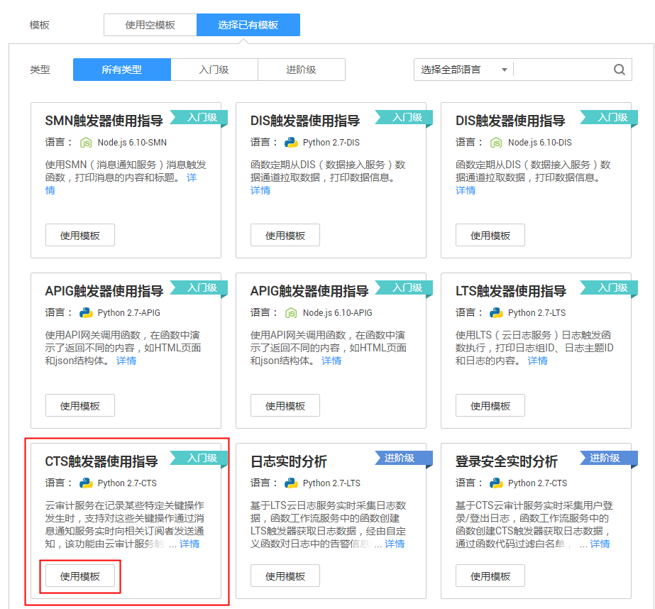
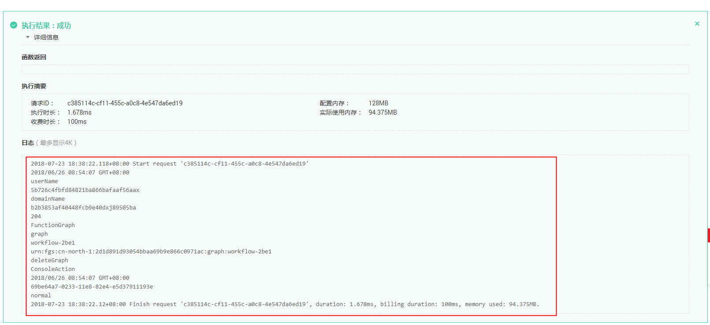

# 使用CTS触发器<a name="functiongraph_01_0209"></a>

本节介绍创建CTS触发器，通过增加自定义操作，触发函数运行，通过CTS云审计服务获取操作记录，供用户了解CTS触发器的使用方法。

关于CTS触发器事件源具体介绍请参见[支持的事件源](http://support.huaweicloud.com/devg-functiongraph/functiongraph_02_0102.html)。

## 前提条件<a name="section97094317346"></a>

进行操作之前，需要做好以下准备。

已经在统一身份认证创建委托，创建过程请参考[创建委托](创建委托.md)。

## 创建CTS触发器<a name="section1079628104617"></a>

1.  登录FunctionGraph，进入“函数”界面，选择“函数列表”。
2.  单击界面中“创建函数“，进入“创建函数“界面。
3.  在“创建函数“界面填写函数信息。
    1.  模板选择“已有模板”。
    2.  选择“CTS触发器使用指导”模板，单击“使用此模板”，加载函数代码及配置信息。
    3.  输入函数名称“HelloWorld“。

        **图 1**  选择CTS触发器使用指导模板<a name="fig15260184516341"></a>  
        

    4.  选择委托，此处以“serverless-trust”为例。
    5.  输入CTS触发器配置信息，添加自定义操作，带\*参数为必填项。

        **表 1**  CTS触发器信息表

        <a name="table132624459345"></a>
        <table><thead align="left"><tr id="row132601457341"><th class="cellrowborder" valign="top" width="50%" id="mcps1.2.3.1.1"><p id="p62602458348"><a name="p62602458348"></a><a name="p62602458348"></a>字段</p>
        </th>
        <th class="cellrowborder" valign="top" width="50%" id="mcps1.2.3.1.2"><p id="p1226064513348"><a name="p1226064513348"></a><a name="p1226064513348"></a>填写说明</p>
        </th>
        </tr>
        </thead>
        <tbody><tr id="row1026014523411"><td class="cellrowborder" valign="top" width="50%" headers="mcps1.2.3.1.1 "><p id="p13260645163411"><a name="p13260645163411"></a><a name="p13260645163411"></a>*通知名称</p>
        </td>
        <td class="cellrowborder" valign="top" width="50%" headers="mcps1.2.3.1.2 "><p id="p42608454341"><a name="p42608454341"></a><a name="p42608454341"></a>支持汉字、字母、数字和下划线，且长度不能超过64个字符。</p>
        <p id="p14260114533411"><a name="p14260114533411"></a><a name="p14260114533411"></a>输入“Test”。</p>
        </td>
        </tr>
        <tr id="row202611145173413"><td class="cellrowborder" valign="top" width="50%" headers="mcps1.2.3.1.1 "><p id="p42614455344"><a name="p42614455344"></a><a name="p42614455344"></a>*服务类型</p>
        </td>
        <td class="cellrowborder" valign="top" width="50%" headers="mcps1.2.3.1.2 "><p id="p426120458349"><a name="p426120458349"></a><a name="p426120458349"></a>服务类型，此处选择“FunctionGraph”服务。</p>
        </td>
        </tr>
        <tr id="row18261164553415"><td class="cellrowborder" valign="top" width="50%" headers="mcps1.2.3.1.1 "><p id="p626184510345"><a name="p626184510345"></a><a name="p626184510345"></a>*资源类型</p>
        </td>
        <td class="cellrowborder" valign="top" width="50%" headers="mcps1.2.3.1.2 "><p id="p11261144553413"><a name="p11261144553413"></a><a name="p11261144553413"></a>所选服务下对应的资源类型，如工作流、触发器、实例、事件。</p>
        <p id="p1326184516344"><a name="p1326184516344"></a><a name="p1326184516344"></a>此处选择“graph”。</p>
        </td>
        </tr>
        <tr id="row92611345123414"><td class="cellrowborder" valign="top" width="50%" headers="mcps1.2.3.1.1 "><p id="p42611645193410"><a name="p42611645193410"></a><a name="p42611645193410"></a>*操作名称</p>
        </td>
        <td class="cellrowborder" valign="top" width="50%" headers="mcps1.2.3.1.2 "><p id="p926124573413"><a name="p926124573413"></a><a name="p926124573413"></a>所选资源类型下对应的操作，如创建、删除工作流。</p>
        <p id="p32613454348"><a name="p32613454348"></a><a name="p32613454348"></a>此处选择“createGraph”。</p>
        </td>
        </tr>
        <tr id="row726134513341"><td class="cellrowborder" valign="top" width="50%" headers="mcps1.2.3.1.1 "><p id="p4261174523416"><a name="p4261174523416"></a><a name="p4261174523416"></a>*操作</p>
        </td>
        <td class="cellrowborder" valign="top" width="50%" headers="mcps1.2.3.1.2 "><p id="p5261945203414"><a name="p5261945203414"></a><a name="p5261945203414"></a>可以进行“删除”的操作。</p>
        </td>
        </tr>
        </tbody>
        </table>

        > **说明：**   
        >CTS触发器最多支持添加10个服务，每个服务10个操作，总共可添加100个操作，服务及操作详情可参考[支持审计的服务及详细操作列表](https://support.huaweicloud.com/usermanual-cts/zh-cn_topic_0100236046.html)。  


4.  单击“创建函数“，创建函数和触发器。

    **图 2**  CTS触发器<a name="fig17810134418435"></a>  
    


## 配置CTS事件触发函数<a name="section1581734219447"></a>

1.  登录FunctionGraph，进入“函数”界面。
2.  在“函数”界面，选择“函数列表”，单击HelloWorld函数名称，进入HelloWorld函数详情界面。
3.  在HelloWorld函数详情页，选择函数版本，单击“请选择测试事件\>配置测试事件”，如[图3](#fig127617362010)所示，弹出“配置测试事件”页。

    **图 3**  配置CTS测试事件<a name="fig127617362010"></a>  
    

4.  在“配置测试事件”界面填写如[表2](#table19101881852)所示测试信息后单击“保存”，带\*参数为必填项。

    **表 2**  测试信息

    <a name="table19101881852"></a>
    <table><thead align="left"><tr id="row18991818517"><th class="cellrowborder" valign="top" width="28.000000000000004%" id="mcps1.2.3.1.1"><p id="p1199882517"><a name="p1199882517"></a><a name="p1199882517"></a>参数</p>
    </th>
    <th class="cellrowborder" valign="top" width="72%" id="mcps1.2.3.1.2"><p id="p1399481516"><a name="p1399481516"></a><a name="p1399481516"></a>说明</p>
    </th>
    </tr>
    </thead>
    <tbody><tr id="row15991688510"><td class="cellrowborder" valign="top" width="28.000000000000004%" headers="mcps1.2.3.1.1 "><p id="p99910817514"><a name="p99910817514"></a><a name="p99910817514"></a>配置测试事件</p>
    </td>
    <td class="cellrowborder" valign="top" width="72%" headers="mcps1.2.3.1.2 "><p id="p699481551"><a name="p699481551"></a><a name="p699481551"></a>可创建新的测试事件也可编辑已有的测试事件。</p>
    <p id="p189928655"><a name="p189928655"></a><a name="p189928655"></a>选择默认值：“创建新的测试事件”。</p>
    </td>
    </tr>
    <tr id="row17100881156"><td class="cellrowborder" valign="top" width="28.000000000000004%" headers="mcps1.2.3.1.1 "><p id="p19988857"><a name="p19988857"></a><a name="p19988857"></a>事件模板</p>
    </td>
    <td class="cellrowborder" valign="top" width="72%" headers="mcps1.2.3.1.2 "><p id="p3991681155"><a name="p3991681155"></a><a name="p3991681155"></a>选择"cts-event-template"模板，使用系统内置CTS事件模板。</p>
    </td>
    </tr>
    <tr id="row15100481555"><td class="cellrowborder" valign="top" width="28.000000000000004%" headers="mcps1.2.3.1.1 "><p id="p410058956"><a name="p410058956"></a><a name="p410058956"></a>*事件名称</p>
    </td>
    <td class="cellrowborder" valign="top" width="72%" headers="mcps1.2.3.1.2 "><p id="p010028051"><a name="p010028051"></a><a name="p010028051"></a>事件名称必须仅包含字母和数字，且最大长度为 25 个字符。</p>
    <p id="p17100982056"><a name="p17100982056"></a><a name="p17100982056"></a>输入“cts-test”。</p>
    </td>
    </tr>
    <tr id="row111012081952"><td class="cellrowborder" valign="top" width="28.000000000000004%" headers="mcps1.2.3.1.1 "><p id="p14100208953"><a name="p14100208953"></a><a name="p14100208953"></a>测试事件</p>
    </td>
    <td class="cellrowborder" valign="top" width="72%" headers="mcps1.2.3.1.2 "><p id="p14100881055"><a name="p14100881055"></a><a name="p14100881055"></a>自动加载系统内置cts事件模板，本例不做修改。</p>
    </td>
    </tr>
    </tbody>
    </table>

    > **说明：**   
    >测试事件模板示例如下：  
    >```  
    >{  
    >    "cts":  {  
    >        "time": "2018/06/26 08:54:07 GMT+08:00",  
    >        "user": {  
    >            "name": "userName",  
    >            "id": "5b726c4fbfd84821ba866bafaaf56aax",  
    >            "domain": {  
    >                "name": "domainName",  
    >                "id": "b2b3853af40448fcb9e40dxj89505ba"  
    >            }  
    >        },  
    >        "request": {},  
    >        "response": {},  
    >        "code": 204,  
    >        "service_type": "FunctionGraph",  
    >        "resource_type": "graph",  
    >        "resource_name": "workflow-2be1",  
    >        "resource_id": "urn:fgs:cn-north-1:2d1d891d93054bbaa69b9e866c0971ac:graph:workflow-2be1",  
    >        "trace_name": "deleteGraph",  
    >        "trace_type": "ConsoleAction",  
    >        "record_time": "2018/06/26 08:54:07 GMT+08:00",  
    >        "trace_id": "69be64a7-0233-11e8-82e4-e5d37911193e",  
    >        "trace_status": "normal"  
    >    }  
    >}  
    >```  

5.  单击“测试”，可以得到函数运行结果记录。如[图4](#fig208549118408)所示。

    **图 4**  CTS触发器测试结果<a name="fig208549118408"></a>  
    


