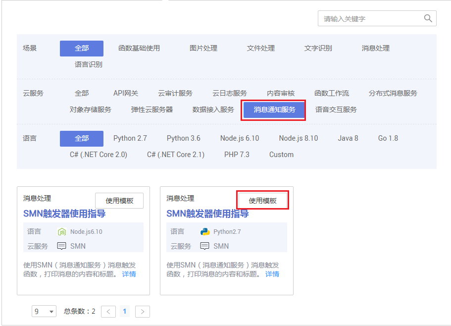

# 使用函数模板

FunctionGraph平台提供了函数模板，在创建函数时选择模板，实现模板代码、触发器、运行环境自动填充，快速构建应用程序。

## 函数模板说明

FunctionGraph提供了24个模板，包括18个入门级模板和6个进阶级模板，说明如[表1](#table4658883110497)所示。

**表 1**  模板说明

<table><thead align="left"><tr id="row3226503410497"><th class="cellrowborder" valign="top" width="33.33333333333333%" id="mcps1.2.4.1.1">
模板类别

</th>
<th class="cellrowborder" valign="top" width="33.33333333333333%" id="mcps1.2.4.1.2">
模板名称

</th>
<th class="cellrowborder" valign="top" width="33.33333333333333%" id="mcps1.2.4.1.3">
模板说明

</th>
</tr>
</thead>
<tbody><tr id="row1787406510497"><td class="cellrowborder" rowspan="10" valign="top" width="33.33333333333333%" headers="mcps1.2.4.1.1 ">
入门级

</td>
<td class="cellrowborder" valign="top" width="33.33333333333333%" headers="mcps1.2.4.1.2 ">
context使用指导

</td>
<td class="cellrowborder" valign="top" width="33.33333333333333%" headers="mcps1.2.4.1.3 ">
使用函数获取访问其他华为云服务所需的临时凭证，包括AK、SK、Token等。

</td>
</tr>
<tr id="row4710306510497"><td class="cellrowborder" valign="top" headers="mcps1.2.4.1.1 ">
从OBS下载文件

</td>
<td class="cellrowborder" valign="top" headers="mcps1.2.4.1.2 ">
使用函数从指定的OBS（对象存储服务）桶中下载文件，读取文件并返回文件大小。

</td>
</tr>
<tr id="row5753071210497"><td class="cellrowborder" valign="top" headers="mcps1.2.4.1.1 ">
上传文件到OBS

</td>
<td class="cellrowborder" valign="top" headers="mcps1.2.4.1.2 ">
使用函数上传本地文件至指定的OBS（对象存储服务）桶。

</td>
</tr>
<tr id="row6519532610497"><td class="cellrowborder" valign="top" headers="mcps1.2.4.1.1 ">
DMS触发器使用指导

</td>
<td class="cellrowborder" valign="top" headers="mcps1.2.4.1.2 ">
函数定期从DMS（分布式消息服务）消费组拉取待消费消息，打印消息内容及属性。

</td>
</tr>
<tr id="row5242489910497"><td class="cellrowborder" valign="top" headers="mcps1.2.4.1.1 ">
SMN触发器使用指导

</td>
<td class="cellrowborder" valign="top" headers="mcps1.2.4.1.2 ">
使用SMN（消息通知服务）消息触发函数，打印消息的内容和标题。

</td>
</tr>
<tr id="row3595453310497"><td class="cellrowborder" valign="top" headers="mcps1.2.4.1.1 ">
DIS触发器使用指导

</td>
<td class="cellrowborder" valign="top" headers="mcps1.2.4.1.2 ">
函数定期从DIS（数据接入服务）数据通道拉取数据，打印数据信息。

</td>
</tr>
<tr id="row108881110497"><td class="cellrowborder" valign="top" headers="mcps1.2.4.1.1 ">
APIG触发器使用指导

</td>
<td class="cellrowborder" valign="top" headers="mcps1.2.4.1.2 ">
使用API网关调用函数服务，在函数中演示了返回不同的内容，如HTML页面和json结构体。

</td>
</tr>
<tr id="row763614162428"><td class="cellrowborder" valign="top" headers="mcps1.2.4.1.1 ">
LTS触发器使用指导

</td>
<td class="cellrowborder" valign="top" headers="mcps1.2.4.1.2 ">
使用LTS（云日志服务）日志触发函数执行，打印日志组ID、日志主题ID和日志的内容。

</td>
</tr>
<tr id="row74381923174211"><td class="cellrowborder" valign="top" headers="mcps1.2.4.1.1 ">
CTS触发器使用指导

</td>
<td class="cellrowborder" valign="top" headers="mcps1.2.4.1.2 ">
云审计服务在记录某些特定关键操作发生时，支持对这些关键操作通过消息通知服务实时向相关订阅者发送通知，该功能由云审计服务触发，消息通知触发用户函数。

</td>
</tr>
<tr id="row3781788710552"><td class="cellrowborder" valign="top" headers="mcps1.2.4.1.1 ">
实时图片分类（按图片大小）

</td>
<td class="cellrowborder" valign="top" headers="mcps1.2.4.1.2 ">
上传图片至OBS（对象存储服务）桶，触发函数运行，根据图片大小，分类存储图片到不同的桶中。

</td>
</tr>
<tr id="row10840185420282"><td class="cellrowborder" rowspan="6" valign="top" width="33.33333333333333%" headers="mcps1.2.4.1.1 ">
进阶级

</td>
<td class="cellrowborder" valign="top" width="33.33333333333333%" headers="mcps1.2.4.1.2 ">
日志实时分析

</td>
<td class="cellrowborder" valign="top" width="33.33333333333333%" headers="mcps1.2.4.1.3 ">
基于LTS云日志服务实时采集日志数据，函数工作流服务中的函数创建LTS触发器获取日志数据，经由自定义函数对日志中的告警信息进行分析和处理，通过SMN服务推送告警信息，并将告警日志集中存储在OBS桶中。

</td>
</tr>
<tr id="row128901199264"><td class="cellrowborder" valign="top" headers="mcps1.2.4.1.1 ">
登录安全实时分析

</td>
<td class="cellrowborder" valign="top" headers="mcps1.2.4.1.2 ">
基于CTS云审计服务实时采集用户登录/登出日志，函数工作流服务中的函数创建CTS触发器获取日志数据，通过函数代码过滤白名单，非法登录时SMN服务推送用户订阅的资源信息。

</td>
</tr>
<tr id="row108663474478"><td class="cellrowborder" valign="top" headers="mcps1.2.4.1.1 ">
实时图片分类（按图片内容）

</td>
<td class="cellrowborder" valign="top" headers="mcps1.2.4.1.2 ">
基于EI服务构建图片分类的无服务系统。连接EI服务，调用EI服务图片分类接口对图片进行分类，并通过OBS触发器，对每个上传到桶中的图片进行分类处理，自动将图片归档到相应的类别目录下。

</td>
</tr>
<tr id="row9868247114714"><td class="cellrowborder" valign="top" headers="mcps1.2.4.1.1 ">
图片鉴黄

</td>
<td class="cellrowborder" valign="top" headers="mcps1.2.4.1.2 ">
基于EI服务构建图片鉴黄的无服务系统。连接EI服务，调用EI服务鉴黄接口检测图片是否为色情图片，并通过APIG触发器提供接口供外部调用。

</td>
</tr>
<tr id="row1686944715472"><td class="cellrowborder" valign="top" headers="mcps1.2.4.1.1 ">
图片鉴黄

</td>
<td class="cellrowborder" valign="top" headers="mcps1.2.4.1.2 ">
基于EI服务构建实时图片鉴黄的无服务器系统。连接EI服务，调用EI服务鉴黄接口检测图片是否为色情图片，并通过OBS触发器实现实时图片检测。

</td>
</tr>
<tr id="row11226342105"><td class="cellrowborder" valign="top" headers="mcps1.2.4.1.1 ">
语音识别

</td>
<td class="cellrowborder" valign="top" headers="mcps1.2.4.1.2 ">
基于EI服务构建语音识别的无服务系统。连接EI服务，调用EI服务语音识别接口将wav语音文件转化为文字，并通过APIG触发器提供接口供外部调用。

</td>
</tr>
</tbody>
</table>

## 函数模板使用

**创建函数及触发器**

1.  用户登录FunctionGraph，进入“应用模板”界面。
2.  在“应用模板”界面，选择“SMN触发器使用指导”模板，单击“使用此模板”，如[图1](#fig93204100572)所示。
3.  选择函数模板后，会加载模板内置的代码、配置、触发器信息，进入到创建函数界面。
4.  输入函数名称：read-smn-message。
5.  SMN触发器主题名称选择serverless-Test。

    **图 1**  选择函数模板  
    

6.  单击“创建函数”，创建函数及触发器，如[图2](#fig12320161015576)所示。

    **图 2**  SMN触发器  
    

**触发函数**

1.  登录“消息通知服务”，单击“主题管理\>主题”，进入“主题”界面。
2.  在“主题”界面，单击serverless-Test消息主题名称，进入“主题详情页”。
3.  在“主题详情页”，单击操作栏的“发布消息”，如[图3](#fig8101161217)所示，弹出“发布消息”界面。

    **图 3**  发布SMN消息  
    

4.  在“发布消息”界面，填写发布信息，如[表2](#table1910111112116)所示，带\*参数为必填项。

    **表 2**  发布信息表

    
    <table><thead align="left"><tr id="row151011411111"><th class="cellrowborder" valign="top" width="50%" id="mcps1.2.3.1.1">
字段

    </th>
    <th class="cellrowborder" valign="top" width="50%" id="mcps1.2.3.1.2">
填写说明

    </th>
    </tr>
    </thead>
    <tbody><tr id="row121011716114"><td class="cellrowborder" valign="top" width="50%" headers="mcps1.2.3.1.1 ">
消息标题

    </td>
    <td class="cellrowborder" valign="top" width="50%" headers="mcps1.2.3.1.2 ">
输入“SMN-Test”。

    </td>
    </tr>
    <tr id="row3101121719"><td class="cellrowborder" valign="top" width="50%" headers="mcps1.2.3.1.1 ">
*消息类型

    </td>
    <td class="cellrowborder" valign="top" width="50%" headers="mcps1.2.3.1.2 ">
选择“文本消息”。

    </td>
    </tr>
    <tr id="row61016119120"><td class="cellrowborder" valign="top" width="50%" headers="mcps1.2.3.1.1 ">
*消息内容

    </td>
    <td class="cellrowborder" valign="top" width="50%" headers="mcps1.2.3.1.2 ">
输入以下内容：hello。

    </td>
    </tr>
    </tbody>
    </table>

    > **说明：**   
    >1.  消息发布具体参数说明请参见[向主题发布消息](https://support.huaweicloud.com/usermanual-smn/zh-cn_topic_0043961403.html)。  

5.  单击“确定”，完成消息发布。

    > **说明：**   
    >1.  消息发布以后，会自动触发函数运行，具体示例事件请参见[支持的事件源](http://support.huaweicloud.com/devg-functiongraph/functiongraph_02_0102.html)  。  

6.  消息触发函数运行，返回FunctionGraph查看函数日志。

