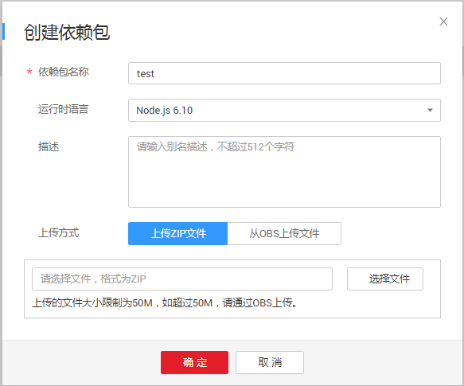
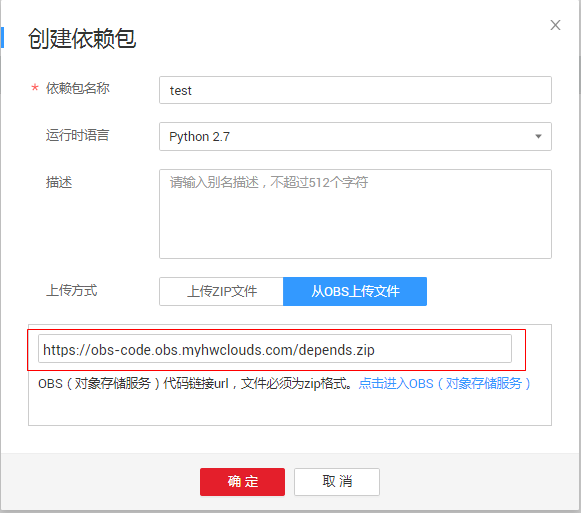

# 依赖包管理<a name="ZH-CN_TOPIC_0149027344"></a>

依赖包管理模块统一管理用户所有的依赖包，用户可以通过本地上传和obs地址的形式上传依赖包，并为依赖包命名。

函数依赖包生成示例请参考[如何安装函数依赖包](https://support.huaweicloud.com/functiongraph_faq/functiongraph_03_0343.html)。

## 创建依赖包<a name="section20663228121820"></a>

1.  用户登录FunctionGraph控制台，进入“函数”界面。
2.  选择“依赖包”进入依赖包管理界面，点击界面中的“创建依赖包”，如[图1](#fig397504405519)所示。

    **图 1**  依赖包界面<a name="fig397504405519"></a>  
    

3.  在弹出的“创建依赖包”界面输入依赖包名称等信息，如[图2](#fig24191426102712)所示。

    **图 2**  创建依赖包<a name="fig24191426102712"></a>  
    

    > **说明：**   
    >1.  依赖包名称，命名规则为：  
    >    -   可包含字母、数字、下划线和中划线，长度不超过60个字符。  
    >    -   以大/小写字母开头，以字母或数字结尾。  
    >2.  用户可以通过本地上传和obs地址的形式上传依赖包。  

4.  点击“确定”完成创建。

## 配置函数依赖<a name="section17207213143810"></a>

1.  用户登录FunctionGraph控制台，进入“函数”界面。
2.  选择“函数列表”，点击函数名称进入函数详情页面。
3.  选择“代码”页签，在“依赖代码包”处点击“添加”。
4.  在弹出的依赖包选择界面中，选择依赖包，点击确定，如[图3](#fig8914144710536)所示。

    **图 3**  选择依赖包<a name="fig8914144710536"></a>  
    

    > **说明：**   
    >-   一个函数最多可添加20个依赖包。  
    >-   除了用户自己创建的依赖包（私有依赖包）以外，FunctionGraph还提供了一些常见的公共依赖包，用户可以直接选择使用。  


## 删除依赖包<a name="section176546567"></a>

1.  用户登录FunctionGraph控制台，进入“函数”界面。
2.  选择“依赖包”，在需要删除的依赖包操作栏点击“删除”。如[图4](#fig17954185805912)所示。

    **图 4**  删除<a name="fig17954185805912"></a>  
    

3.  点击“确定”。

    > **说明：**   
    >如果当前已经有函数使用了该依赖包，则无法删除。  


## 引入依赖库<a name="section15256184918590"></a>

**支持的依赖库说明**

FunctionGraph支持引入标准库及第三方依赖库。

-   标准库

    对于标准库，无论是在线编辑或是线下开发打包上传至FunctionGraph，均可以直接在代码中引入，使用其功能。

-   FunctionGraph支持的非标准库

    FunctionGraph内置一些三方件，如[表1](#table143351951242)、[表2](#table39721459145614)所示。像标准库一样，在编写代码时直接引入，使用其功能。

    **表 1**  Node.js Runtime集成的三方件

    <a name="table143351951242"></a>
    <table><thead align="left"><tr id="row15336557411"><th class="cellrowborder" valign="top" width="28.532853285328528%" id="mcps1.2.4.1.1"><p id="p1033655643"><a name="p1033655643"></a><a name="p1033655643"></a>名称</p>
    </th>
    <th class="cellrowborder" valign="top" width="38.133813381338136%" id="mcps1.2.4.1.2"><p id="p233635143"><a name="p233635143"></a><a name="p233635143"></a>功能</p>
    </th>
    <th class="cellrowborder" valign="top" width="33.33333333333333%" id="mcps1.2.4.1.3"><p id="p1733612515413"><a name="p1733612515413"></a><a name="p1733612515413"></a>版本号</p>
    </th>
    </tr>
    </thead>
    <tbody><tr id="row113361153412"><td class="cellrowborder" valign="top" width="28.532853285328528%" headers="mcps1.2.4.1.1 "><p id="p1336195243"><a name="p1336195243"></a><a name="p1336195243"></a>q</p>
    </td>
    <td class="cellrowborder" valign="top" width="38.133813381338136%" headers="mcps1.2.4.1.2 "><p id="p12336151410"><a name="p12336151410"></a><a name="p12336151410"></a>异步方法封装</p>
    </td>
    <td class="cellrowborder" valign="top" width="33.33333333333333%" headers="mcps1.2.4.1.3 "><p id="p18336851148"><a name="p18336851148"></a><a name="p18336851148"></a>1.5.1</p>
    </td>
    </tr>
    <tr id="row33369511419"><td class="cellrowborder" valign="top" width="28.532853285328528%" headers="mcps1.2.4.1.1 "><p id="p123366511415"><a name="p123366511415"></a><a name="p123366511415"></a>co</p>
    </td>
    <td class="cellrowborder" valign="top" width="38.133813381338136%" headers="mcps1.2.4.1.2 "><p id="p17336751942"><a name="p17336751942"></a><a name="p17336751942"></a>异步流程控制</p>
    </td>
    <td class="cellrowborder" valign="top" width="33.33333333333333%" headers="mcps1.2.4.1.3 "><p id="p173361651142"><a name="p173361651142"></a><a name="p173361651142"></a>4.6.0</p>
    </td>
    </tr>
    <tr id="row103361751945"><td class="cellrowborder" valign="top" width="28.532853285328528%" headers="mcps1.2.4.1.1 "><p id="p833614510419"><a name="p833614510419"></a><a name="p833614510419"></a>lodash</p>
    </td>
    <td class="cellrowborder" valign="top" width="38.133813381338136%" headers="mcps1.2.4.1.2 "><p id="p1633611514410"><a name="p1633611514410"></a><a name="p1633611514410"></a>常用工具方法库</p>
    </td>
    <td class="cellrowborder" valign="top" width="33.33333333333333%" headers="mcps1.2.4.1.3 "><p id="p14336457412"><a name="p14336457412"></a><a name="p14336457412"></a>4.17.10</p>
    </td>
    </tr>
    <tr id="row10336550412"><td class="cellrowborder" valign="top" width="28.532853285328528%" headers="mcps1.2.4.1.1 "><p id="p93361251844"><a name="p93361251844"></a><a name="p93361251844"></a>esdk-obs-nodejs</p>
    </td>
    <td class="cellrowborder" valign="top" width="38.133813381338136%" headers="mcps1.2.4.1.2 "><p id="p143361453415"><a name="p143361453415"></a><a name="p143361453415"></a>OBS sdk</p>
    </td>
    <td class="cellrowborder" valign="top" width="33.33333333333333%" headers="mcps1.2.4.1.3 "><p id="p203383519412"><a name="p203383519412"></a><a name="p203383519412"></a>2.1.5</p>
    </td>
    </tr>
    <tr id="row99017489112"><td class="cellrowborder" valign="top" width="28.532853285328528%" headers="mcps1.2.4.1.1 "><p id="p441934817265"><a name="p441934817265"></a><a name="p441934817265"></a>express</p>
    </td>
    <td class="cellrowborder" valign="top" width="38.133813381338136%" headers="mcps1.2.4.1.2 "><p id="p1141984892615"><a name="p1141984892615"></a><a name="p1141984892615"></a>极简web开发框架</p>
    </td>
    <td class="cellrowborder" valign="top" width="33.33333333333333%" headers="mcps1.2.4.1.3 "><p id="p1341974802613"><a name="p1341974802613"></a><a name="p1341974802613"></a>4.16.4</p>
    </td>
    </tr>
    <tr id="row6439151514"><td class="cellrowborder" valign="top" width="28.532853285328528%" headers="mcps1.2.4.1.1 "><p id="p5572124552610"><a name="p5572124552610"></a><a name="p5572124552610"></a>fgs-express</p>
    </td>
    <td class="cellrowborder" valign="top" width="38.133813381338136%" headers="mcps1.2.4.1.2 "><p id="p17572104515268"><a name="p17572104515268"></a><a name="p17572104515268"></a>在FunctionGraph和API Gateway之上使用现有的Node.js应用程序框架运行无服务器应用程序和REST API 。提供的示例允许您使用Express框架轻松构建无服务器Web应用程序/服务和RESTful API 。</p>
    </td>
    <td class="cellrowborder" valign="top" width="33.33333333333333%" headers="mcps1.2.4.1.3 "><p id="p357334510265"><a name="p357334510265"></a><a name="p357334510265"></a>1.0.1</p>
    </td>
    </tr>
    <tr id="row74216551117"><td class="cellrowborder" valign="top" width="28.532853285328528%" headers="mcps1.2.4.1.1 "><p id="p194242051192617"><a name="p194242051192617"></a><a name="p194242051192617"></a>request</p>
    </td>
    <td class="cellrowborder" valign="top" width="38.133813381338136%" headers="mcps1.2.4.1.2 "><p id="p0424195115262"><a name="p0424195115262"></a><a name="p0424195115262"></a>简化http调用, 支持HTTPS并默认遵循重定向</p>
    </td>
    <td class="cellrowborder" valign="top" width="33.33333333333333%" headers="mcps1.2.4.1.3 "><p id="p1942410516269"><a name="p1942410516269"></a><a name="p1942410516269"></a>2.88.0</p>
    </td>
    </tr>
    </tbody>
    </table>

    **表 2**  Python Runtime支持的非标准库

    <a name="table39721459145614"></a>
    <table><thead align="left"><tr id="row38504252145614"><th class="cellrowborder" valign="top" width="33.33333333333333%" id="mcps1.2.4.1.1"><p id="p18095115145614"><a name="p18095115145614"></a><a name="p18095115145614"></a>模块</p>
    </th>
    <th class="cellrowborder" valign="top" width="33.33333333333333%" id="mcps1.2.4.1.2"><p id="p56418216145614"><a name="p56418216145614"></a><a name="p56418216145614"></a>功能</p>
    </th>
    <th class="cellrowborder" valign="top" width="33.33333333333333%" id="mcps1.2.4.1.3"><p id="p6472802145614"><a name="p6472802145614"></a><a name="p6472802145614"></a>版本号</p>
    </th>
    </tr>
    </thead>
    <tbody><tr id="row27527076145614"><td class="cellrowborder" valign="top" width="33.33333333333333%" headers="mcps1.2.4.1.1 "><p id="p61556839145835"><a name="p61556839145835"></a><a name="p61556839145835"></a>dateutil</p>
    </td>
    <td class="cellrowborder" valign="top" width="33.33333333333333%" headers="mcps1.2.4.1.2 "><p id="p20048058145835"><a name="p20048058145835"></a><a name="p20048058145835"></a>日期/时间处理</p>
    </td>
    <td class="cellrowborder" valign="top" width="33.33333333333333%" headers="mcps1.2.4.1.3 "><p id="p13280010145835"><a name="p13280010145835"></a><a name="p13280010145835"></a>2.6.0</p>
    </td>
    </tr>
    <tr id="row31269908145614"><td class="cellrowborder" valign="top" width="33.33333333333333%" headers="mcps1.2.4.1.1 "><p id="p20787913145835"><a name="p20787913145835"></a><a name="p20787913145835"></a>requests</p>
    </td>
    <td class="cellrowborder" valign="top" width="33.33333333333333%" headers="mcps1.2.4.1.2 "><p id="p6099393145835"><a name="p6099393145835"></a><a name="p6099393145835"></a>http库</p>
    </td>
    <td class="cellrowborder" valign="top" width="33.33333333333333%" headers="mcps1.2.4.1.3 "><p id="p21238847145835"><a name="p21238847145835"></a><a name="p21238847145835"></a>2.7.0</p>
    </td>
    </tr>
    <tr id="row49919776145614"><td class="cellrowborder" valign="top" width="33.33333333333333%" headers="mcps1.2.4.1.1 "><p id="p2253865145835"><a name="p2253865145835"></a><a name="p2253865145835"></a>httplib2</p>
    </td>
    <td class="cellrowborder" valign="top" width="33.33333333333333%" headers="mcps1.2.4.1.2 "><p id="p48345381145835"><a name="p48345381145835"></a><a name="p48345381145835"></a>httpclient</p>
    </td>
    <td class="cellrowborder" valign="top" width="33.33333333333333%" headers="mcps1.2.4.1.3 "><p id="p23661785145835"><a name="p23661785145835"></a><a name="p23661785145835"></a>0.10.3</p>
    </td>
    </tr>
    <tr id="row62147669142314"><td class="cellrowborder" valign="top" width="33.33333333333333%" headers="mcps1.2.4.1.1 "><p id="p37098266142327"><a name="p37098266142327"></a><a name="p37098266142327"></a>numpy</p>
    </td>
    <td class="cellrowborder" valign="top" width="33.33333333333333%" headers="mcps1.2.4.1.2 "><p id="p12907260142336"><a name="p12907260142336"></a><a name="p12907260142336"></a>数学计算</p>
    </td>
    <td class="cellrowborder" valign="top" width="33.33333333333333%" headers="mcps1.2.4.1.3 "><p id="p25505478142347"><a name="p25505478142347"></a><a name="p25505478142347"></a>1.13.1</p>
    </td>
    </tr>
    <tr id="row14959080145614"><td class="cellrowborder" valign="top" width="33.33333333333333%" headers="mcps1.2.4.1.1 "><p id="p56491286145835"><a name="p56491286145835"></a><a name="p56491286145835"></a>redis</p>
    </td>
    <td class="cellrowborder" valign="top" width="33.33333333333333%" headers="mcps1.2.4.1.2 "><p id="p12391471145835"><a name="p12391471145835"></a><a name="p12391471145835"></a>redis客户端</p>
    </td>
    <td class="cellrowborder" valign="top" width="33.33333333333333%" headers="mcps1.2.4.1.3 "><p id="p31607657145835"><a name="p31607657145835"></a><a name="p31607657145835"></a>2.10.5</p>
    </td>
    </tr>
    <tr id="row51131826145614"><td class="cellrowborder" valign="top" width="33.33333333333333%" headers="mcps1.2.4.1.1 "><p id="p35946515145835"><a name="p35946515145835"></a><a name="p35946515145835"></a>obsclient</p>
    </td>
    <td class="cellrowborder" valign="top" width="33.33333333333333%" headers="mcps1.2.4.1.2 "><p id="p25986613145835"><a name="p25986613145835"></a><a name="p25986613145835"></a>OBS客户端</p>
    </td>
    <td class="cellrowborder" valign="top" width="33.33333333333333%" headers="mcps1.2.4.1.3 "><p id="p41658471145835"><a name="p41658471145835"></a><a name="p41658471145835"></a>-</p>
    </td>
    </tr>
    <tr id="row67511052536"><td class="cellrowborder" valign="top" width="33.33333333333333%" headers="mcps1.2.4.1.1 "><p id="p20456111512267"><a name="p20456111512267"></a><a name="p20456111512267"></a>smnsdk</p>
    </td>
    <td class="cellrowborder" valign="top" width="33.33333333333333%" headers="mcps1.2.4.1.2 "><p id="p14527042152416"><a name="p14527042152416"></a><a name="p14527042152416"></a>访问公有云smn服务</p>
    </td>
    <td class="cellrowborder" valign="top" width="33.33333333333333%" headers="mcps1.2.4.1.3 "><p id="p5530154219246"><a name="p5530154219246"></a><a name="p5530154219246"></a>1.0.1</p>
    </td>
    </tr>
    </tbody>
    </table>


-   其他第三方库（FunctionGraph暂没有内置的非标准三方库）

    将依赖的第三方库打包，上传至OBS桶，在创建函数时配置依赖包的OBS存储地址，在函数代码中即可使用其功能。


**引入依赖库示例**

处理图片的函数代码如下。

```
# -*- coding: utf-8 -*-
from PIL import Image, ImageEnhance

from com.obs.client.obs_client import ObsClient

import sys
import os

current_file_path = os.path.dirname(os.path.realpath(__file__))
# append current path to search paths, so that we can import some third party libraries.
sys.path.append(current_file_path)
region = 'china'
obs_server = 'obs.xxxxxxcloud.com'
def newObsClient(context):
    ak = context.getAccessKey()
    sk = context.getSecretKey()
    return ObsClient(access_key_id=ak, secret_access_key=sk, server=obs_server,
                     path_style=True, region=region, ssl_verify=False, max_retry_count=5, timeout=20)
def downloadFile(obsClient, bucket, objName, localFile):
    resp = obsClient.getObject(bucket, objName, localFile)
    if resp.status < 300:
        print 'download file', file, 'succeed'
    else:
        print('download failed, errorCode: %s, errorMessage: %s, requestId: %s' % resp.errorCode, resp.errorMessage,
              resp.requestId)
def uploadFileToObs(client, bucket, objName, file):
    resp = client.putFile(bucket, objName, file)
    if resp.status < 300:
        print 'upload file', file, 'succeed'
    else:
        print('upload failed, errorCode: %s, errorMessage: %s, requestId: %s' % resp.errorCode, resp.errorMessage,
              resp.requestId)
def getObjInfoFromObsEvent(event):
    s3 = event['Records'][0]['s3']
    eventName = event['Records'][0]['eventName']
    bucket = s3['bucket']['name']
    objName = s3['object']['key']
    print "*** obsEventName: %s, srcBucketName: %s, objName: %s", eventName, bucket, objName
    return bucket, objName
def set_opacity(im, opacity):
    """设置透明度"""
    if im.mode != "RGBA":
        im = im.convert('RGBA')
    else:
        im = im.copy()
    alpha = im.split()[3]
    alpha = ImageEnhance.Brightness(alpha).enhance(opacity)
    im.putalpha(alpha)
    return im
def watermark(im, mark, opacity=0.6):
    """添加水印"""
    try:
        if opacity < 1:
            mark = set_opacity(mark, opacity)
        if im.mode != 'RGBA':
            im = im.convert('RGBA')
        if im.size[0] < mark.size[0] or im.size[1] < mark.size[1]:
            print "The mark image size is larger size than original image file."
            return False
        x = (im.size[0] - mark.size[0]) / 2
        y = (im.size[1] - mark.size[1]) / 2
        layer = Image.new('RGBA', im.size, )
        layer.paste(mark, (x, y))
        return Image.composite(layer, im, layer)
    except Exception as e:
        print ">>>>>>>>>>> WaterMark EXCEPTION:  " + str(e)
        return False
def watermark_image(localFile, fileName):
    im = Image.open(localFile)
    watermark_image_path = os.path.join(current_file_path, "watermark.png")
    mark = Image.open(watermark_image_path)
    out = watermark(im, mark)
    print "**********finish water mark"
    name = fileName.split('.')
    outFileName = name[0] + '-watermark.' + name[1]
    outFilePath = "/tmp/" + outFileName
    if out:
        out = out.convert('RGB')
        out.save(outFilePath)
    else:
        print "Sorry, Save watermarked file Failed."
    return outFileName, outFilePath
def handler(event, context):
    srcBucket, srcObjName = getObjInfoFromObsEvent(event)
    outputBucket = context.getUserData('obs_output_bucket')
    client = newObsClient(context)
    # download file uploaded by user from obs
    localFile = "/tmp/" + srcObjName
    downloadFile(client, srcBucket, srcObjName, localFile)
    outFileName, outFile = watermark_image(localFile, srcObjName)
    # 将转换后的文件上传到新的obs桶中
    uploadFileToObs(client, outputBucket, outFileName, outFile)
    return 'OK'
```

对于标准库和FunctionGraph支持的非标准库，可以直接引入。

对于FunctionGraph暂没有内置的非标准三方库，通过以下步骤引入。

1.  将依赖的库文件打包（ZIP包），上传至OBS存储桶，获得依赖包的OBS存储链接，如[图5](#fig25831619101417)所示。

    **图 5**  上传依赖包至OBS<a name="fig25831619101417"></a>  
    

2.  在函数界面选择“依赖包”，进入依赖包界面，选择“创建依赖包”，如[图6](#fig17285348185416)所示。

    **图 6**  依赖包管理界面<a name="fig17285348185416"></a>  
    

3.  在创建依赖包界面中输入OBS存储链接，创建依赖代码包，如[图7](#fig19291348174016)所示。

    **图 7**  设置依赖包<a name="fig19291348174016"></a>  
    

4.  进入函数详情页面，选择“代码”页签，在“依赖代码包”处点击“添加”，配置依赖包，如[图8](#fig99985398482)所示。

    **图 8**  添加依赖包<a name="fig99985398482"></a>  
    

5.  在代码中引入依赖库。

    > **警告：**   
    >各个依赖包和代码包之间尽量不要有相同的目录或文件，比如依赖包depends.zip，里面有index.py这个文件，如果代码采用在线编辑方式，函数执行入口为index.handler，这样在函数执行的时候会产生一个代码文件index.py，跟依赖包里面的index.py文件同名，两个文件可能会因覆盖合并而出错。  


