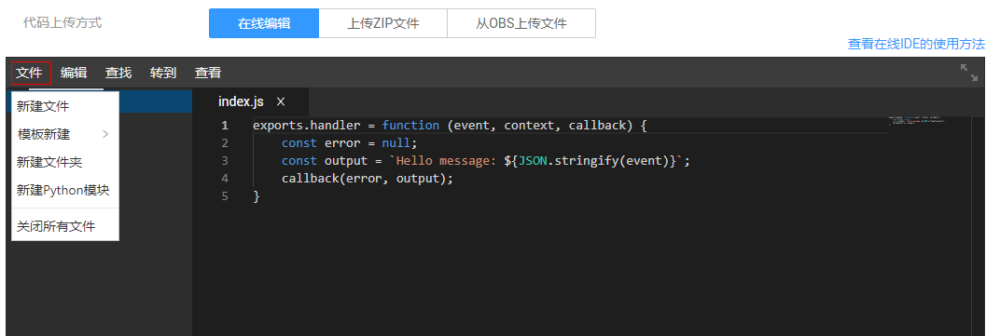
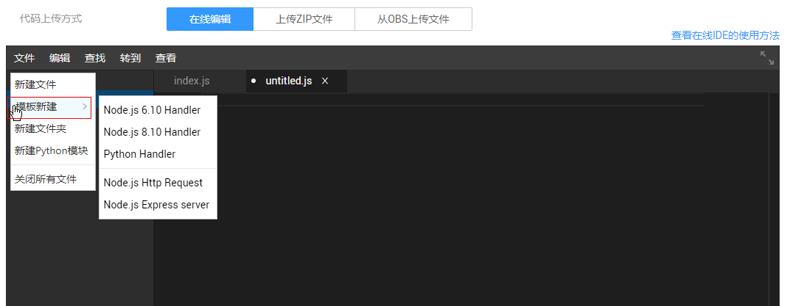
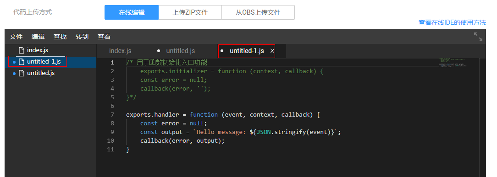
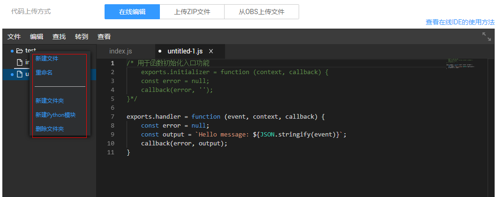
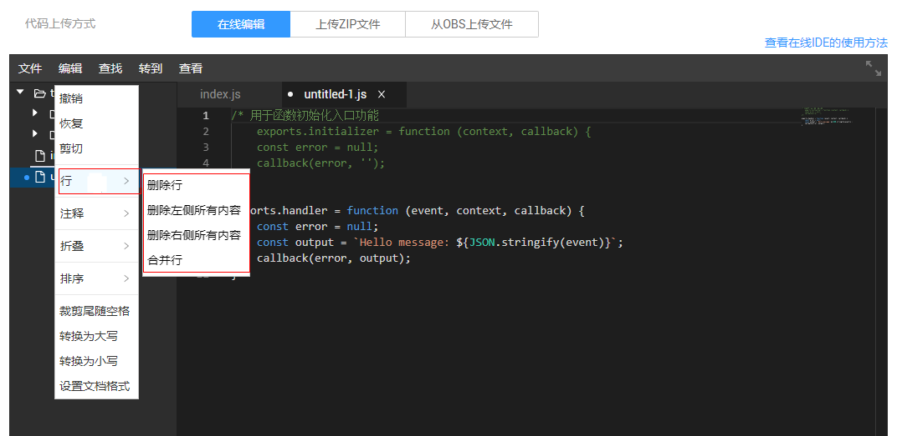

# 函数在线IDE

用户在编辑函数代码时支持类似工程方式的管理，可以创建文件、文件夹并对其进行编辑。使用函数工作流控制台中的在线代码编辑器，可以在线编写函数代码，如果代码是上传zip包的方式，则前端进行相应解压展示，并支持在线编辑修改。同时，在线代码编辑器支持在线测试和保存，可以查看函数执行的返回、执行摘要和日志，该功能需要在编辑器全屏模式下使用。

## 目录管理

在编辑器菜单栏中选择“文件“，可以管理文件夹目录，如[图1](#fig178581024427)所示。

**图 1**  文件  

在展开的下拉菜单中选择“新建文件“，可以新建文件，并命名，如[图2](#fig149931128166)所示。

**图 2**  新建文件  

在展开的下拉菜单中选择“新建模板“，可以选择模板在线创建函数，如[图3](#fig205241622182211)所示。

**图 3**  新建模板  

选择需要的模板，创建在线函数，并命名，如[图4](#fig7934126183117)所示。

**图 4**  创建文件  

点击右键，选择“重命名“可以对文件和文件夹进行重命名，选择“删除“可以删除，如[图5](#fig66113363115)所示。

**图 5**  文件重命名  

在左侧“文件“下拉菜单中选择“新建文件夹“，新建文件夹并命名，如[图1](#fig178581024427)中所示。

点击右键，选择“新建文件“可以在该文件夹目录下新建文件，在该菜单栏中，可以对文件夹重命名、新建Python模块、删除文件夹，如[图6](#fig566662975417)所示。

**图 6**  编辑文件夹  

在左侧“文件“下拉菜单中选择“关闭所有文件“，将所有打开的文件关闭，如[图1](#fig178581024427)中所示。

支持快速创建Python模块，支持多创建层级，如[图7](#fig189941830144015)所示。

**图 7**  多层级模块  

## 代码在线编辑

在编辑器菜单栏中选择“编辑“，可以在线编辑代码。在下拉菜单中可以撤销操作或恢复上一步操作，也可以剪切内容等，如[图8](#fig14556546142119)所示。

**图 8**  在线编辑  

在下拉菜单中选择“行“，可以对代码以“行”为单位进行编辑，如[图9](#fig2055691113414)所示。

**图 9**  编辑行  

在“行“命令的展开菜单中，选择“删除行“，可以删除整行代码。选择“删除左侧所有内容“，可以将鼠标光标所在位置左侧的代码删除，同样选择“删除右侧所有内容“，将右侧代码删除。选择“合并行“，将光标所在代码行的下一行代码合入到该行。

在“编辑“下拉菜单中选择“注释“，可以编辑注释，如[图10](#fig8603826151316)所示。

**图 10**  编辑注释  

在“注释“命令的展开菜单中，选择“切换行注释“打开某一行代码的注释，选择“切换块注释“打开某一块代码的注释，选择“添加行注释“增加一行注释，选择“删除行注释“删除一行注释。

在“编辑“下拉菜单中选择“折叠”，可以展开或折叠代码，如[图11](#fig135351222211)所示。

**图 11**  展开或折叠代码  

代码可以全部展开或折叠，按层级折叠请选择“Fold Level“。

选择“排序“对代码行进行排序，如[图12](#fig168960195217)所示。

**图 12**  排序  

“编辑”菜单栏中同时可以裁剪尾随空格、转换大小写、设置文档格式等。

## 查找及替换

在编辑器菜单栏中选择“查找“，可以进行查找或替换。如[图13](#fig66217271244)所示。

**图 13**  查找  

在展开的下拉菜单中选择“查找“或“替换“，输入内容，进行查找或替换代码，如[图14](#fig10516771593)所示。

**图 14**  查找代码  

## 跳转

在编辑菜单栏中选择“转到“，可以跳转到相应的代码位置，如[图15](#fig522514818159)所示。

**图 15**  转到  

在展开的下拉菜单中选择“转到行“，可以跳转到对应的代码行，如[图16](#fig1762485815308)所示。

**图 16**  跳转  

当代码比较多时，选择一个反括号“\{”，点击“转到括号“可跳转到相应的括号“\}”位置，当代码中有错误时，点击“转到下一个问题（错误、告警、或信息）“跳转到下一个错误的地方。

## 函数在线测试

在编辑器全屏模式下，函数配置测试事件，点击“测试”测试函数，显示函数返回、执行摘要和日志，如[图17](#fig6116171416315)所示。

**图 17**  函数在线测试  

## 通用功能

1.在编辑菜单栏中选择“查看”，在下拉的菜单栏中选择“主题”可以更换编辑器主题，选择“显示命令面板”可以查看所有命令，如[图18](#fig154421332458)所示。

**图 18**  查看所有命令  

2.编辑器具有代码智能提示功能，如[图19](#fig12131171316247)所示。

**图 19**  智能提示  

3.支持左侧工作区域调整宽度，文件可以拖拽移动，同时本地文件可以拖拽上传。

