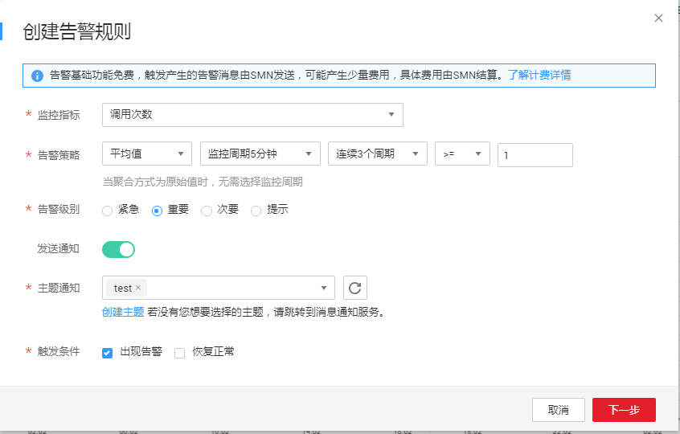

# 函数监控

函数及触发器创建以后，可以实时监控函数被调用及运行情况。

## 监控函数

不同版本函数的监控信息做了区分，查询函数指标之前设置函数版本，可以查询不同版本对应的监控信息。

**操作步骤**

1.  用户登录FunctionGraph，进入“函数”界面。
2.  选择“函数列表”，单击函数名称，进入函数详情界面。
3.  选择函数对应的版本或者别名，单击“函数指标”页签。
4.  在“函数指标”页签，选择时间粒度（5分钟、15分钟、1小时），查看函数运行状态。

    > **说明：**   
    >可以查看的指标有：调用次数、错误次数、运行时间（包括最大运行时间、最小运行时间、平均运行时间）、被拒绝次数。  

**指标说明**

运行监控指标说明如[表1](#table34086103152643)所示。

**表 1**  监控指标说明表

<table><thead align="left"><tr id="row45907106152643"><th class="cellrowborder" valign="top" width="22.06220622062206%" id="mcps1.2.4.1.1">
指标

</th>
<th class="cellrowborder" valign="top" width="15.611561156115611%" id="mcps1.2.4.1.2">
单位

</th>
<th class="cellrowborder" valign="top" width="62.32623262326232%" id="mcps1.2.4.1.3">
说明

</th>
</tr>
</thead>
<tbody><tr id="row66862752152643"><td class="cellrowborder" valign="top" width="22.06220622062206%" headers="mcps1.2.4.1.1 ">
调用次数

</td>
<td class="cellrowborder" valign="top" width="15.611561156115611%" headers="mcps1.2.4.1.2 ">
次

</td>
<td class="cellrowborder" valign="top" width="62.32623262326232%" headers="mcps1.2.4.1.3 ">
函数总的调用请求数，包含了错误和被拒绝的调用。异步调用在该请求实际被系统执行时才开始计数。

</td>
</tr>
<tr id="row66766826144056"><td class="cellrowborder" valign="top" width="22.06220622062206%" headers="mcps1.2.4.1.1 ">
运行时间

</td>
<td class="cellrowborder" valign="top" width="15.611561156115611%" headers="mcps1.2.4.1.2 ">
毫秒

</td>
<td class="cellrowborder" valign="top" width="62.32623262326232%" headers="mcps1.2.4.1.3 ">
最大运行时间为某统计粒度（周期）下，即某一时间段内单次函数执行最大的运行时间。

最小运行时间为某统计粒度（周期）下，即某一时间段内单次函数执行最小的运行时间。

平均运行时间为某统计粒度（周期）下，即某一时间段内单次函数执行平均的运行时间。

</td>
</tr>
<tr id="row13067190152643"><td class="cellrowborder" valign="top" width="22.06220622062206%" headers="mcps1.2.4.1.1 ">
错误次数

</td>
<td class="cellrowborder" valign="top" width="15.611561156115611%" headers="mcps1.2.4.1.2 ">
次

</td>
<td class="cellrowborder" valign="top" width="62.32623262326232%" headers="mcps1.2.4.1.3 ">
指发生异常请求的函数不能正确执行完并且返回200，都计入错误次数。函数自身的语法错误或自身执行错误也会计入该指标。

</td>
</tr>
<tr id="row19350802152643"><td class="cellrowborder" valign="top" width="22.06220622062206%" headers="mcps1.2.4.1.1 ">
被拒绝次数

</td>
<td class="cellrowborder" valign="top" width="15.611561156115611%" headers="mcps1.2.4.1.2 ">
次

</td>
<td class="cellrowborder" valign="top" width="62.32623262326232%" headers="mcps1.2.4.1.3 ">
由于并发请求太多，系统流控而被拒绝的请求次数。

</td>
</tr>
</tbody>
</table>

## 查看监控图表

函数实现与云监控服务的对接，函数上报云监控服务的监控指标，用户可以通过云监控服务来查看函数产生的监控指标和告警信息。

1.  用户登录FunctionGraph，进入“函数”界面。
2.  选择“函数列表”，单击函数名称，进入函数详情界面。
3.  选择函数对应的版本或者别名，单击“函数指标”页签。
4.  在“函数指标”页签，单击“创建告警规则”，进入“创建告警规则”页面。
5.  在“创建告警规则”页面，输入告警参数，单击“创建”。如[图1](#fig94491549337)所示。

    **图 1**  创建告警规则  
    

6.  在“函数指标”页签，单击“查看监控图表”，进入云监控服务页面查看函数监控指标。如[图2](#fig1063488105)所示。

    **图 2**  查看监控指标  
    

**指标说明**

告警监控指标如[表2](#table8963813131616)所示。

**表 2**  告警监控指标说明表

<table><thead align="left"><tr id="row19964413141615"><th class="cellrowborder" valign="top" width="11.92119211921192%" id="mcps1.2.10.1.1">
<strong id="b48959453436">指标名称</strong>

</th>
<th class="cellrowborder" valign="top" width="11.92119211921192%" id="mcps1.2.10.1.2">
<strong id="b14897144554319">显示名</strong>

</th>
<th class="cellrowborder" valign="top" width="14.031403140314033%" id="mcps1.2.10.1.3">
<strong id="b1989744584315">描述</strong>

</th>
<th class="cellrowborder" valign="top" width="8.110811081108112%" id="mcps1.2.10.1.4">
<strong id="b6898144574315">单位</strong>

</th>
<th class="cellrowborder" valign="top" width="8.840884088408842%" id="mcps1.2.10.1.5">
<strong id="b10900134554314">上限值</strong>

</th>
<th class="cellrowborder" valign="top" width="9.25092509250925%" id="mcps1.2.10.1.6">
<strong id="b7901134516431">下限值</strong>

</th>
<th class="cellrowborder" valign="top" width="10.81108110811081%" id="mcps1.2.10.1.7">
<strong id="b390354574319">建议阈值</strong>

</th>
<th class="cellrowborder" valign="top" width="10.181018101810182%" id="mcps1.2.10.1.8">
<strong id="b15904134584310">值类型</strong>

</th>
<th class="cellrowborder" valign="top" width="14.931493149314932%" id="mcps1.2.10.1.9">
<strong id="b149060456438">所属维度</strong>

</th>
</tr>
</thead>
<tbody><tr id="row1996421316161"><td class="cellrowborder" valign="top" width="11.92119211921192%" headers="mcps1.2.10.1.1 ">
count

</td>
<td class="cellrowborder" valign="top" width="11.92119211921192%" headers="mcps1.2.10.1.2 ">
调用次数

</td>
<td class="cellrowborder" valign="top" width="14.031403140314033%" headers="mcps1.2.10.1.3 ">
该指标用于统计函数调用次数

</td>
<td class="cellrowborder" valign="top" width="8.110811081108112%" headers="mcps1.2.10.1.4 ">
次数

</td>
<td class="cellrowborder" valign="top" width="8.840884088408842%" headers="mcps1.2.10.1.5 ">
-

</td>
<td class="cellrowborder" valign="top" width="9.25092509250925%" headers="mcps1.2.10.1.6 ">
0

</td>
<td class="cellrowborder" valign="top" width="10.81108110811081%" headers="mcps1.2.10.1.7 ">
-

</td>
<td class="cellrowborder" valign="top" width="10.181018101810182%" headers="mcps1.2.10.1.8 ">
int

</td>
<td class="cellrowborder" valign="top" width="14.931493149314932%" headers="mcps1.2.10.1.9 ">
package-functionname

</td>
</tr>
<tr id="row1196441310167"><td class="cellrowborder" valign="top" width="11.92119211921192%" headers="mcps1.2.10.1.1 ">
failcount

</td>
<td class="cellrowborder" valign="top" width="11.92119211921192%" headers="mcps1.2.10.1.2 ">
错误次数

</td>
<td class="cellrowborder" valign="top" width="14.031403140314033%" headers="mcps1.2.10.1.3 ">
该指标用于统计函数调用错误次数

</td>
<td class="cellrowborder" valign="top" width="8.110811081108112%" headers="mcps1.2.10.1.4 ">
次数

</td>
<td class="cellrowborder" valign="top" width="8.840884088408842%" headers="mcps1.2.10.1.5 ">
-

</td>
<td class="cellrowborder" valign="top" width="9.25092509250925%" headers="mcps1.2.10.1.6 ">
0

</td>
<td class="cellrowborder" valign="top" width="10.81108110811081%" headers="mcps1.2.10.1.7 ">
-

</td>
<td class="cellrowborder" valign="top" width="10.181018101810182%" headers="mcps1.2.10.1.8 ">
int

</td>
<td class="cellrowborder" valign="top" width="14.931493149314932%" headers="mcps1.2.10.1.9 ">
package-functionname

</td>
</tr>
<tr id="row6965913151610"><td class="cellrowborder" valign="top" width="11.92119211921192%" headers="mcps1.2.10.1.1 ">
rejectcount

</td>
<td class="cellrowborder" valign="top" width="11.92119211921192%" headers="mcps1.2.10.1.2 ">
被拒绝次数

</td>
<td class="cellrowborder" valign="top" width="14.031403140314033%" headers="mcps1.2.10.1.3 ">
该指标用于统计函数调用被拒绝次数

</td>
<td class="cellrowborder" valign="top" width="8.110811081108112%" headers="mcps1.2.10.1.4 ">
次数

</td>
<td class="cellrowborder" valign="top" width="8.840884088408842%" headers="mcps1.2.10.1.5 ">
-

</td>
<td class="cellrowborder" valign="top" width="9.25092509250925%" headers="mcps1.2.10.1.6 ">
0

</td>
<td class="cellrowborder" valign="top" width="10.81108110811081%" headers="mcps1.2.10.1.7 ">
-

</td>
<td class="cellrowborder" valign="top" width="10.181018101810182%" headers="mcps1.2.10.1.8 ">
int

</td>
<td class="cellrowborder" valign="top" width="14.931493149314932%" headers="mcps1.2.10.1.9 ">
package-functionname

</td>
</tr>
<tr id="row149651613111612"><td class="cellrowborder" valign="top" width="11.92119211921192%" headers="mcps1.2.10.1.1 ">
duration

</td>
<td class="cellrowborder" valign="top" width="11.92119211921192%" headers="mcps1.2.10.1.2 ">
平均运行时间

</td>
<td class="cellrowborder" valign="top" width="14.031403140314033%" headers="mcps1.2.10.1.3 ">
该指标用于统计函数调用平均运行时间

</td>
<td class="cellrowborder" valign="top" width="8.110811081108112%" headers="mcps1.2.10.1.4 ">
毫秒

</td>
<td class="cellrowborder" valign="top" width="8.840884088408842%" headers="mcps1.2.10.1.5 ">
-

</td>
<td class="cellrowborder" valign="top" width="9.25092509250925%" headers="mcps1.2.10.1.6 ">
0

</td>
<td class="cellrowborder" valign="top" width="10.81108110811081%" headers="mcps1.2.10.1.7 ">
-

</td>
<td class="cellrowborder" valign="top" width="10.181018101810182%" headers="mcps1.2.10.1.8 ">
int

</td>
<td class="cellrowborder" valign="top" width="14.931493149314932%" headers="mcps1.2.10.1.9 ">
package-functionname

</td>
</tr>
<tr id="row796581316168"><td class="cellrowborder" valign="top" width="11.92119211921192%" headers="mcps1.2.10.1.1 ">
maxDuration

</td>
<td class="cellrowborder" valign="top" width="11.92119211921192%" headers="mcps1.2.10.1.2 ">
最大运行时间

</td>
<td class="cellrowborder" valign="top" width="14.031403140314033%" headers="mcps1.2.10.1.3 ">
该指标用于统计函数调用最大运行时间

</td>
<td class="cellrowborder" valign="top" width="8.110811081108112%" headers="mcps1.2.10.1.4 ">
毫秒

</td>
<td class="cellrowborder" valign="top" width="8.840884088408842%" headers="mcps1.2.10.1.5 ">
-

</td>
<td class="cellrowborder" valign="top" width="9.25092509250925%" headers="mcps1.2.10.1.6 ">
0

</td>
<td class="cellrowborder" valign="top" width="10.81108110811081%" headers="mcps1.2.10.1.7 ">
-

</td>
<td class="cellrowborder" valign="top" width="10.181018101810182%" headers="mcps1.2.10.1.8 ">
int

</td>
<td class="cellrowborder" valign="top" width="14.931493149314932%" headers="mcps1.2.10.1.9 ">
package-functionname

</td>
</tr>
<tr id="row4966141319168"><td class="cellrowborder" valign="top" width="11.92119211921192%" headers="mcps1.2.10.1.1 ">
minDuration

</td>
<td class="cellrowborder" valign="top" width="11.92119211921192%" headers="mcps1.2.10.1.2 ">
最小运行时间

</td>
<td class="cellrowborder" valign="top" width="14.031403140314033%" headers="mcps1.2.10.1.3 ">
该指标用于统计函数调用最小运行时间

</td>
<td class="cellrowborder" valign="top" width="8.110811081108112%" headers="mcps1.2.10.1.4 ">
毫秒

</td>
<td class="cellrowborder" valign="top" width="8.840884088408842%" headers="mcps1.2.10.1.5 ">
-

</td>
<td class="cellrowborder" valign="top" width="9.25092509250925%" headers="mcps1.2.10.1.6 ">
0

</td>
<td class="cellrowborder" valign="top" width="10.81108110811081%" headers="mcps1.2.10.1.7 ">
-

</td>
<td class="cellrowborder" valign="top" width="10.181018101810182%" headers="mcps1.2.10.1.8 ">
int

</td>
<td class="cellrowborder" valign="top" width="14.931493149314932%" headers="mcps1.2.10.1.9 ">
package-functionname

</td>
</tr>
</tbody>
</table>

## 查询日志

日志支持下载，选择时间范围，点击“下载”即可下载该时间范围内的所有日志。

1.  用户登录FunctionGraph，进入“函数”界面。
2.  选择“函数列表”，单击函数名称，进入函数详情界面。
3.  选择函数对应的版本或者别名，单击“日志”页签。
4.  在“日志”页签，输入查询条件,。

    > **说明：**   
    >1.  支持的日志查询条件：“时间+关键字”。  
    >2.  支持的时间条件：最近5分钟、最近30分钟、最近1小时及自定义时间段。  

5.  单击“”，查询日志。

    > **说明：**   
    >-   日志查询结果包含的字段有：函数实例、摘要、操作。  
    >-   查询到日志后，单击“操作”栏的“查看上下文”，查看日志详细信息。  

## 下载日志

1.  用户登录FunctionGraph，进入“函数”界面。
2.  选择“函数列表”，单击函数名称，进入函数详情界面。
3.  选择函数对应的版本或者别名，单击“日志”页签。
4.  在“日志”页签，选择时间范围，点击“下载”，如[图3](#fig4350655734)所示。

    **图 3**  下载日志  
    

    > **说明：**   
    >一次最多只能下载5000条日志，所以请合理选择时间范围，避免下载的日志缺失。  

