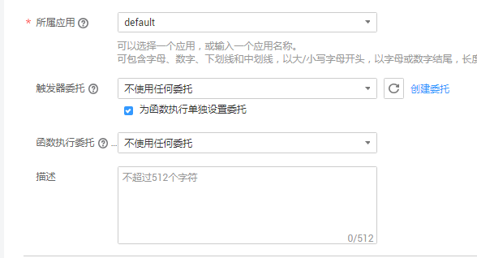
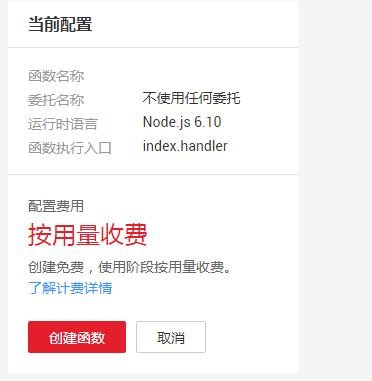
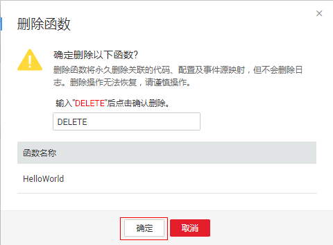

# 函数管理<a name="functiongraph_01_0320"></a>

函数是实现某一功能所需代码、运行时、资源、设置的组合，是可以独立运行的最小单元。函数通过Trigger触发，自行调度所需资源及环境，实现预期功能。

引入函数应用概念，用户可以按照业务逻辑在创建函数的时候创建函数应用，在相应函数应用下创建多个函数，方便的管理跟业务相关的一组函数。

## 代码上传方式创建函数<a name="section205271147183118"></a>

1.  用户登录FunctionGraph，进入“函数”界面。
2.  在“函数”界面，选择“函数列表”，单击“创建函数”，进入“创建函数”界面。
3.  在“创建方式“栏选择“代码上传“。
4.  在“创建函数”界面填写函数信息。
    1.  填写基础配置信息，如[表1](#table1278331211237)所示，带\*参数为必填项。

        **表 1**  函数基础配置信息表

        <a name="table1278331211237"></a>
        <table><thead align="left"><tr id="row1206649611237"><th class="cellrowborder" valign="top" width="50%" id="mcps1.2.3.1.1"><p id="p2260087111244"><a name="p2260087111244"></a><a name="p2260087111244"></a>参数</p>
        </th>
        <th class="cellrowborder" valign="top" width="50%" id="mcps1.2.3.1.2"><p id="p1873123811244"><a name="p1873123811244"></a><a name="p1873123811244"></a>说明</p>
        </th>
        </tr>
        </thead>
        <tbody><tr id="row64848314316"><td class="cellrowborder" valign="top" width="50%" headers="mcps1.2.3.1.1 "><p id="p148014315491"><a name="p148014315491"></a><a name="p148014315491"></a>模板</p>
        </td>
        <td class="cellrowborder" valign="top" width="50%" headers="mcps1.2.3.1.2 "><p id="p77103167322"><a name="p77103167322"></a><a name="p77103167322"></a>使用空白模板需要配置函数基本信息和代码信息。</p>
        <p id="p5278279215491"><a name="p5278279215491"></a><a name="p5278279215491"></a>使用已有模板会加载模板内置的配置信息，请参考<a href="使用函数模板.md">使用函数模板</a>。</p>
        </td>
        </tr>
        <tr id="row4352610011237"><td class="cellrowborder" valign="top" width="50%" headers="mcps1.2.3.1.1 "><p id="p1932480211244"><a name="p1932480211244"></a><a name="p1932480211244"></a>*函数名称</p>
        </td>
        <td class="cellrowborder" valign="top" width="50%" headers="mcps1.2.3.1.2 "><p id="p2180510211244"><a name="p2180510211244"></a><a name="p2180510211244"></a>函数名称，命名规则为：</p>
        <a name="ul56704030174437"></a><a name="ul56704030174437"></a><ul id="ul56704030174437"><li>可包含字母、数字、下划线和中划线，长度不超过60个字符。</li><li>以大/小写字母开头，以字母或数字结尾。</li></ul>
        </td>
        </tr>
        <tr id="row8198103111812"><td class="cellrowborder" valign="top" width="50%" headers="mcps1.2.3.1.1 "><p id="p3433337131414"><a name="p3433337131414"></a><a name="p3433337131414"></a>*所属应用</p>
        </td>
        <td class="cellrowborder" valign="top" width="50%" headers="mcps1.2.3.1.2 "><p id="p114331937191415"><a name="p114331937191415"></a><a name="p114331937191415"></a>用户创建函数时可以进行分组，每个函数应用下面可以创建多个函数，在函数创建时可以选择其归属于某个函数应用，或输入函数应用名称进行新建。命名规则如下：</p>
        <a name="ul519219971112"></a><a name="ul519219971112"></a><ul id="ul519219971112"><li>可包含字母、数字、下划线和中划线，长度不超过60个字符。</li><li>以大/小写字母开头，以字母或数字结尾。</li></ul>
        </td>
        </tr>
        <tr id="row19709913185232"><td class="cellrowborder" valign="top" width="50%" headers="mcps1.2.3.1.1 "><p id="p6566631511244"><a name="p6566631511244"></a><a name="p6566631511244"></a>委托名称</p>
        </td>
        <td class="cellrowborder" valign="top" width="50%" headers="mcps1.2.3.1.2 "><p id="p42531832101712"><a name="p42531832101712"></a><a name="p42531832101712"></a>用户委托函数工作流服务去访问其他的云服务，举例：如果用户函数需要访问OBS、DMS等服务，则需要提供权限委托名称，如果用户函数不访问任何云服务，则不用提供委托名称。</p>
        <p id="p12693124112435"><a name="p12693124112435"></a><a name="p12693124112435"></a>从下拉列表中选择，如果下拉列表没有选项，单击“创建委托”，进入“统一身份认证服务&gt;委托”页面中创建。</p>
        <p id="p1737128011244"><a name="p1737128011244"></a><a name="p1737128011244"></a>委托的创建请参考<a href="创建委托.md">创建委托</a>。</p>
        </td>
        </tr>
        <tr id="row10271167193411"><td class="cellrowborder" valign="top" width="50%" headers="mcps1.2.3.1.1 "><p id="p155015218345"><a name="p155015218345"></a><a name="p155015218345"></a>函数描述</p>
        </td>
        <td class="cellrowborder" valign="top" width="50%" headers="mcps1.2.3.1.2 "><p id="p6517102114341"><a name="p6517102114341"></a><a name="p6517102114341"></a>对函数的描述，不超过512个字符。</p>
        </td>
        </tr>
        </tbody>
        </table>

        > **说明：**   
        >-   在创建函数过程中选择委托时，勾选“为函数执行单独设置委拖”时，弹出“触发器委托”栏，函数执行委托与触发器委托可独立设置，这将减小不必要的性能损耗；不勾选，函数执行和触发器将使用同一委托。如[图1](#fig11875175135113)所示。  
        >    **图 1**  委托<a name="fig11875175135113"></a>    
        >      
        >    1.  触发器委托，如果函数需要创建DMS或DIS触发器，则需要配置具有DMS或DIS访问权限的委托。  
        >    2.  函数执行委托配置后用户可以通过函数执行入口方法中的context参数获取具有委托中权限的token、ak、sk，用于访问其他云服务。  

    2.  填写代码配置信息，如下[表2](#table5022526111324)所示，带\*参数为必填项。

        **表 2**  代码配置信息表

        <a name="table5022526111324"></a>
        <table><thead align="left"><tr id="row1763232911324"><th class="cellrowborder" valign="top" width="50%" id="mcps1.2.3.1.1"><p id="p2204210311337"><a name="p2204210311337"></a><a name="p2204210311337"></a>参数</p>
        </th>
        <th class="cellrowborder" valign="top" width="50%" id="mcps1.2.3.1.2"><p id="p4057989311337"><a name="p4057989311337"></a><a name="p4057989311337"></a>说明</p>
        </th>
        </tr>
        </thead>
        <tbody><tr id="row6506687811324"><td class="cellrowborder" valign="top" width="50%" headers="mcps1.2.3.1.1 "><p id="p2381501011337"><a name="p2381501011337"></a><a name="p2381501011337"></a>运行时语言</p>
        </td>
        <td class="cellrowborder" valign="top" width="50%" headers="mcps1.2.3.1.2 "><p id="p4996764911337"><a name="p4996764911337"></a><a name="p4996764911337"></a>目前支持Python 3.6、Python 2.7、Node.js 6.10、Node.js 8.10、Java 8、Go 1.8、C#(.NET Core 2.0)、C#(.NET Core 2.1)。</p>
        </td>
        </tr>
        <tr id="row1742877911324"><td class="cellrowborder" valign="top" width="50%" headers="mcps1.2.3.1.1 "><p id="p5341241511337"><a name="p5341241511337"></a><a name="p5341241511337"></a>*函数执行入口</p>
        </td>
        <td class="cellrowborder" valign="top" width="50%" headers="mcps1.2.3.1.2 "><a name="ul39394922163636"></a><a name="ul39394922163636"></a><ul id="ul39394922163636"><li>对于Node.js和Python函数，命名规则：[文件名].[函数名]，必须包含“. ”。填写myfunction.handler，则表示函数的文件名为myfunction.js（运行时为Python和Java时则为myfunction.py和myfunction.java），执行的入口函数名为handler。</li><li>对于Java函数，命名规则：对于Java函数，规则为[包名].[文件名].[函数名]，示例：com.huawei.exp.Myfunction.myHandler。</li><li>对于Go函数，命名规则为：[插件名].[函数名]，函数名首字母为大写且不超过128个字符。示例：function.Handler。</li><li>对于C#函数，命名规则为：[应用程序的.NET程序集文件的名称]::[入口执行函数所在的namespace和class名称]::[入口执行函数名称]，示例：HelloCsharp::Example.Hello::Handler。</li></ul>
        </td>
        </tr>
        <tr id="row3754830411324"><td class="cellrowborder" valign="top" width="50%" headers="mcps1.2.3.1.1 "><p id="p3443234011337"><a name="p3443234011337"></a><a name="p3443234011337"></a>代码上传方式</p>
        </td>
        <td class="cellrowborder" valign="top" width="50%" headers="mcps1.2.3.1.2 "><p id="p3755615011337"><a name="p3755615011337"></a><a name="p3755615011337"></a>操作说明如<a href="#table317242911415">表3</a>所示。</p>
        </td>
        </tr>
        </tbody>
        </table>

        **表 3**  函数代码上传方式表

        <a name="table317242911415"></a>
        <table><thead align="left"><tr id="row5169342111415"><th class="cellrowborder" valign="top" width="33.33333333333333%" id="mcps1.2.4.1.1"><p id="p3643182111415"><a name="p3643182111415"></a><a name="p3643182111415"></a>运行时</p>
        </th>
        <th class="cellrowborder" valign="top" width="33.33333333333333%" id="mcps1.2.4.1.2"><p id="p3176055011426"><a name="p3176055011426"></a><a name="p3176055011426"></a>代码上传方式</p>
        </th>
        <th class="cellrowborder" valign="top" width="33.33333333333333%" id="mcps1.2.4.1.3"><p id="p2246774011426"><a name="p2246774011426"></a><a name="p2246774011426"></a>操作</p>
        </th>
        </tr>
        </thead>
        <tbody><tr id="row2088440711415"><td class="cellrowborder" rowspan="3" valign="top" width="33.33333333333333%" headers="mcps1.2.4.1.1 "><p id="p2721253411520"><a name="p2721253411520"></a><a name="p2721253411520"></a>Node.js 6.10</p>
        </td>
        <td class="cellrowborder" valign="top" width="33.33333333333333%" headers="mcps1.2.4.1.2 "><p id="p3978295911426"><a name="p3978295911426"></a><a name="p3978295911426"></a>在线编辑</p>
        </td>
        <td class="cellrowborder" valign="top" width="33.33333333333333%" headers="mcps1.2.4.1.3 "><p id="p94676279344"><a name="p94676279344"></a><a name="p94676279344"></a>在编码框在线编辑代码，相关功能如<a href="#table172682116101">表5</a>所示。</p>
        </td>
        </tr>
        <tr id="row982652511415"><td class="cellrowborder" valign="top" headers="mcps1.2.4.1.1 "><p id="p6531493711426"><a name="p6531493711426"></a><a name="p6531493711426"></a>上传ZIP文件</p>
        </td>
        <td class="cellrowborder" valign="top" headers="mcps1.2.4.1.2 "><p id="p567959679344"><a name="p567959679344"></a><a name="p567959679344"></a>单击“选择文件”，上传本地代码至平台。上传的zip文件大小限制为50M，如超过50M，请使用OBS。</p>
        </td>
        </tr>
        <tr id="row1536670211415"><td class="cellrowborder" valign="top" headers="mcps1.2.4.1.1 "><p id="p2124281411426"><a name="p2124281411426"></a><a name="p2124281411426"></a>从OBS上传文件</p>
        </td>
        <td class="cellrowborder" valign="top" headers="mcps1.2.4.1.2 "><p id="p179522729344"><a name="p179522729344"></a><a name="p179522729344"></a>输入OBS链接URL，函数引用的代码必须是zip包。</p>
        </td>
        </tr>
        <tr id="row13867352381"><td class="cellrowborder" rowspan="3" valign="top" width="33.33333333333333%" headers="mcps1.2.4.1.1 "><p id="p187414449384"><a name="p187414449384"></a><a name="p187414449384"></a>Node.js 8.10</p>
        </td>
        <td class="cellrowborder" valign="top" width="33.33333333333333%" headers="mcps1.2.4.1.2 "><p id="p274724414382"><a name="p274724414382"></a><a name="p274724414382"></a>在线编辑</p>
        </td>
        <td class="cellrowborder" valign="top" width="33.33333333333333%" headers="mcps1.2.4.1.3 "><p id="p12751144414385"><a name="p12751144414385"></a><a name="p12751144414385"></a>在编码框在线编辑代码，相关功能如<a href="#table172682116101">表5</a>所示。</p>
        </td>
        </tr>
        <tr id="row23878353384"><td class="cellrowborder" valign="top" headers="mcps1.2.4.1.1 "><p id="p8762444153814"><a name="p8762444153814"></a><a name="p8762444153814"></a>上传ZIP文件</p>
        </td>
        <td class="cellrowborder" valign="top" headers="mcps1.2.4.1.2 "><p id="p10766204416384"><a name="p10766204416384"></a><a name="p10766204416384"></a>单击“选择文件”，上传本地代码至平台。上传的zip文件大小限制为50M，如超过50M，请使用OBS。</p>
        </td>
        </tr>
        <tr id="row123871035103810"><td class="cellrowborder" valign="top" headers="mcps1.2.4.1.1 "><p id="p177304417388"><a name="p177304417388"></a><a name="p177304417388"></a>从OBS上传文件</p>
        </td>
        <td class="cellrowborder" valign="top" headers="mcps1.2.4.1.2 "><p id="p1677764443813"><a name="p1677764443813"></a><a name="p1677764443813"></a>输入OBS链接URL，函数引用的代码必须是zip包。</p>
        </td>
        </tr>
        <tr id="row2995984011415"><td class="cellrowborder" rowspan="3" valign="top" width="33.33333333333333%" headers="mcps1.2.4.1.1 "><p id="p3449271311527"><a name="p3449271311527"></a><a name="p3449271311527"></a>Python 2.7</p>
        </td>
        <td class="cellrowborder" valign="top" width="33.33333333333333%" headers="mcps1.2.4.1.2 "><p id="p3515343511426"><a name="p3515343511426"></a><a name="p3515343511426"></a>在线编辑</p>
        </td>
        <td class="cellrowborder" valign="top" width="33.33333333333333%" headers="mcps1.2.4.1.3 "><p id="p353515341391"><a name="p353515341391"></a><a name="p353515341391"></a>在编码框在线编辑代码，相关功能如<a href="#table172682116101">表5</a>所示。</p>
        </td>
        </tr>
        <tr id="row3340221611415"><td class="cellrowborder" valign="top" headers="mcps1.2.4.1.1 "><p id="p3095902311426"><a name="p3095902311426"></a><a name="p3095902311426"></a>上传ZIP文件</p>
        </td>
        <td class="cellrowborder" valign="top" headers="mcps1.2.4.1.2 "><p id="p421496189344"><a name="p421496189344"></a><a name="p421496189344"></a>单击“选择文件”，上传本地代码至平台。上传的zip文件大小限制为50M，如超过50M，请使用OBS。</p>
        </td>
        </tr>
        <tr id="row2233078611415"><td class="cellrowborder" valign="top" headers="mcps1.2.4.1.1 "><p id="p2954670911426"><a name="p2954670911426"></a><a name="p2954670911426"></a>从OBS上传文件</p>
        </td>
        <td class="cellrowborder" valign="top" headers="mcps1.2.4.1.2 "><p id="p359943329344"><a name="p359943329344"></a><a name="p359943329344"></a>输入OBS链接URL，函数引用的代码必须是zip包。</p>
        </td>
        </tr>
        <tr id="row398314412619"><td class="cellrowborder" rowspan="3" valign="top" width="33.33333333333333%" headers="mcps1.2.4.1.1 "><p id="p1685914713619"><a name="p1685914713619"></a><a name="p1685914713619"></a>Python 3.6</p>
        </td>
        <td class="cellrowborder" valign="top" width="33.33333333333333%" headers="mcps1.2.4.1.2 "><p id="p1486994717614"><a name="p1486994717614"></a><a name="p1486994717614"></a>在线编辑</p>
        </td>
        <td class="cellrowborder" valign="top" width="33.33333333333333%" headers="mcps1.2.4.1.3 "><p id="p4882194713620"><a name="p4882194713620"></a><a name="p4882194713620"></a>在编码框在线编辑代码，相关功能如<a href="#table172682116101">表5</a>所示。</p>
        </td>
        </tr>
        <tr id="row59855411767"><td class="cellrowborder" valign="top" headers="mcps1.2.4.1.1 "><p id="p179048470612"><a name="p179048470612"></a><a name="p179048470612"></a>上传ZIP文件</p>
        </td>
        <td class="cellrowborder" valign="top" headers="mcps1.2.4.1.2 "><p id="p1791684718612"><a name="p1791684718612"></a><a name="p1791684718612"></a>单击“选择文件”，上传本地代码至平台。上传的zip文件大小限制为50M，如超过50M，请使用OBS。</p>
        </td>
        </tr>
        <tr id="row3986841669"><td class="cellrowborder" valign="top" headers="mcps1.2.4.1.1 "><p id="p693112471263"><a name="p693112471263"></a><a name="p693112471263"></a>从OBS上传文件</p>
        </td>
        <td class="cellrowborder" valign="top" headers="mcps1.2.4.1.2 "><p id="p17942144714617"><a name="p17942144714617"></a><a name="p17942144714617"></a>输入OBS链接URL，函数引用的代码必须是zip包。</p>
        </td>
        </tr>
        <tr id="row1385769011415"><td class="cellrowborder" rowspan="3" valign="top" width="33.33333333333333%" headers="mcps1.2.4.1.1 "><p id="p4254988611533"><a name="p4254988611533"></a><a name="p4254988611533"></a>Java 8</p>
        </td>
        <td class="cellrowborder" valign="top" width="33.33333333333333%" headers="mcps1.2.4.1.2 "><p id="p741325711426"><a name="p741325711426"></a><a name="p741325711426"></a>上传ZIP文件</p>
        </td>
        <td class="cellrowborder" valign="top" width="33.33333333333333%" headers="mcps1.2.4.1.3 "><p id="p3023649344"><a name="p3023649344"></a><a name="p3023649344"></a>单击“选择文件”，上传本地代码至平台。上传的zip文件大小限制为50M，如超过50M，请使用OBS。</p>
        </td>
        </tr>
        <tr id="row3089061311415"><td class="cellrowborder" valign="top" headers="mcps1.2.4.1.1 "><p id="p6145336811426"><a name="p6145336811426"></a><a name="p6145336811426"></a>上传JAR包</p>
        </td>
        <td class="cellrowborder" valign="top" headers="mcps1.2.4.1.2 "><p id="p190974149344"><a name="p190974149344"></a><a name="p190974149344"></a>单击“选择文件”，上传本地JAR包至平台。上传的JAR文件大小限制为50M，如超过50M，请使用OBS。</p>
        </td>
        </tr>
        <tr id="row1746738511415"><td class="cellrowborder" valign="top" headers="mcps1.2.4.1.1 "><p id="p3565039911426"><a name="p3565039911426"></a><a name="p3565039911426"></a>从OBS上传文件</p>
        </td>
        <td class="cellrowborder" valign="top" headers="mcps1.2.4.1.2 "><p id="p72218019344"><a name="p72218019344"></a><a name="p72218019344"></a>输入OBS链接URL，函数引用的代码必须是zip包。</p>
        </td>
        </tr>
        <tr id="row47130698142138"><td class="cellrowborder" rowspan="2" valign="top" width="33.33333333333333%" headers="mcps1.2.4.1.1 "><p id="p21523103142138"><a name="p21523103142138"></a><a name="p21523103142138"></a>Go 1.8</p>
        </td>
        <td class="cellrowborder" valign="top" width="33.33333333333333%" headers="mcps1.2.4.1.2 "><p id="p1541618614229"><a name="p1541618614229"></a><a name="p1541618614229"></a>上传ZIP文件</p>
        </td>
        <td class="cellrowborder" valign="top" width="33.33333333333333%" headers="mcps1.2.4.1.3 "><p id="p4075156914229"><a name="p4075156914229"></a><a name="p4075156914229"></a>单击“选择文件”，上传本地代码至平台。上传的zip文件大小限制为50M，如超过50M，请使用OBS。</p>
        </td>
        </tr>
        <tr id="row948962142138"><td class="cellrowborder" valign="top" headers="mcps1.2.4.1.1 "><p id="p4746729114229"><a name="p4746729114229"></a><a name="p4746729114229"></a>从OBS上传文件</p>
        </td>
        <td class="cellrowborder" valign="top" headers="mcps1.2.4.1.2 "><p id="p1964536114229"><a name="p1964536114229"></a><a name="p1964536114229"></a>输入OBS链接URL，函数引用的代码必须是zip包。</p>
        </td>
        </tr>
        <tr id="row17178750122"><td class="cellrowborder" rowspan="2" valign="top" width="33.33333333333333%" headers="mcps1.2.4.1.1 "><p id="p1281682378"><a name="p1281682378"></a><a name="p1281682378"></a>C#(.NET Core 2.0)</p>
        </td>
        <td class="cellrowborder" valign="top" width="33.33333333333333%" headers="mcps1.2.4.1.2 "><p id="p151788581212"><a name="p151788581212"></a><a name="p151788581212"></a>上传ZIP文件</p>
        </td>
        <td class="cellrowborder" valign="top" width="33.33333333333333%" headers="mcps1.2.4.1.3 "><p id="p165263385123"><a name="p165263385123"></a><a name="p165263385123"></a>单击“选择文件”，上传本地代码至平台。上传的zip文件大小限制为50M，如超过50M，请使用OBS。</p>
        </td>
        </tr>
        <tr id="row20156199181219"><td class="cellrowborder" valign="top" headers="mcps1.2.4.1.1 "><p id="p1156692122"><a name="p1156692122"></a><a name="p1156692122"></a>从OBS上传文件</p>
        </td>
        <td class="cellrowborder" valign="top" headers="mcps1.2.4.1.2 "><p id="p1378814432128"><a name="p1378814432128"></a><a name="p1378814432128"></a>输入OBS链接URL，函数引用的代码必须是zip包。</p>
        </td>
        </tr>
        <tr id="row16678149113513"><td class="cellrowborder" rowspan="2" valign="top" width="33.33333333333333%" headers="mcps1.2.4.1.1 "><p id="p10186454113612"><a name="p10186454113612"></a><a name="p10186454113612"></a>C#(.NET Core 2.1)</p>
        </td>
        <td class="cellrowborder" valign="top" width="33.33333333333333%" headers="mcps1.2.4.1.2 "><p id="p18679164916359"><a name="p18679164916359"></a><a name="p18679164916359"></a>上传ZIP文件</p>
        </td>
        <td class="cellrowborder" valign="top" width="33.33333333333333%" headers="mcps1.2.4.1.3 "><p id="p17679164923518"><a name="p17679164923518"></a><a name="p17679164923518"></a>单击“选择文件”，上传本地代码至平台。上传的zip文件大小限制为50M，如超过50M，请使用OBS。</p>
        </td>
        </tr>
        <tr id="row139575323512"><td class="cellrowborder" valign="top" headers="mcps1.2.4.1.1 "><p id="p89525320351"><a name="p89525320351"></a><a name="p89525320351"></a>从OBS上传文件</p>
        </td>
        <td class="cellrowborder" valign="top" headers="mcps1.2.4.1.2 "><p id="p79535323513"><a name="p79535323513"></a><a name="p79535323513"></a>输入OBS链接URL，函数引用的代码必须是zip包。</p>
        </td>
        </tr>
        </tbody>
        </table>

        > **注意：**   
        >用python语言写代码时，自己创建的包名不能与python标准库同名，否组会提示module加载失败。例如”json“、“lib”，“os”等。  

        > **警告：**   
        >使用在线编辑代码时，系统会明文展示所有输入信息，请不要输入敏感信息（如账户密码等），以防止信息泄露。  


5.  单击“创建函数”，完成函数创建。

    > **说明：**   
    >1.  函数环境配置信息如内存、超时时间、环境变量等，创建函数时不需要设置，使用缺省值，函数创建以后，可以修改，请参考[修改函数配置](#section1560314348363)。  
    >2.  函数创建以后，缺省版本是latest，每个函数都有latest版本。  


## 镜像上传方式创建函数<a name="section172278474184"></a>

1.  登录FunctionGraph，进入“函数”界面。
2.  在“函数”界面，选择“函数列表”，单击“创建函数”，进入“创建函数”界面。
3.  在“创建方式“栏选择“镜像上传“。
4.  在“创建函数”界面填写函数信息。

    填写基础配置信息，如[表4](#table13922957165319)所示，带\*参数为必填项。

    **表 4**  函数基础配置信息表

    <a name="table13922957165319"></a>
    <table><thead align="left"><tr id="row129222577535"><th class="cellrowborder" valign="top" width="50%" id="mcps1.2.3.1.1"><p id="p39221457145315"><a name="p39221457145315"></a><a name="p39221457145315"></a>参数</p>
    </th>
    <th class="cellrowborder" valign="top" width="50%" id="mcps1.2.3.1.2"><p id="p189227578531"><a name="p189227578531"></a><a name="p189227578531"></a>说明</p>
    </th>
    </tr>
    </thead>
    <tbody><tr id="row1392295713536"><td class="cellrowborder" valign="top" width="50%" headers="mcps1.2.3.1.1 "><p id="p179221357125315"><a name="p179221357125315"></a><a name="p179221357125315"></a>*函数名称</p>
    </td>
    <td class="cellrowborder" valign="top" width="50%" headers="mcps1.2.3.1.2 "><p id="p1792275785313"><a name="p1792275785313"></a><a name="p1792275785313"></a>函数名称，命名规则如下：</p>
    <a name="ul1992245715539"></a><a name="ul1992245715539"></a><ul id="ul1992245715539"><li>可包含字母、数字、下划线和中划线，长度不超过60个字符。</li><li>以大/小写字母开头，以字母或数字结尾。</li></ul>
    <p id="p14922057105311"><a name="p14922057105311"></a><a name="p14922057105311"></a>输入HelloWorld。</p>
    </td>
    </tr>
    <tr id="row15922165725317"><td class="cellrowborder" valign="top" width="50%" headers="mcps1.2.3.1.1 "><p id="p129226579536"><a name="p129226579536"></a><a name="p129226579536"></a>*所属应用</p>
    </td>
    <td class="cellrowborder" valign="top" width="50%" headers="mcps1.2.3.1.2 "><p id="p1922957135319"><a name="p1922957135319"></a><a name="p1922957135319"></a>用户创建函数时可以进行分组，每个函数应用下面可以创建多个函数，在函数创建时可以指定其归属于某个函数应用。命名规则如下：</p>
    <a name="ul109221257195319"></a><a name="ul109221257195319"></a><ul id="ul109221257195319"><li>可包含字母、数字、下划线和中划线，长度不超过60个字符。</li><li>以大/小写字母开头，以字母或数字结尾。</li></ul>
    <p id="p792295716539"><a name="p792295716539"></a><a name="p792295716539"></a>选择默认的“default”应用。</p>
    </td>
    </tr>
    <tr id="row15922195716533"><td class="cellrowborder" valign="top" width="50%" headers="mcps1.2.3.1.1 "><p id="p1292285717533"><a name="p1292285717533"></a><a name="p1292285717533"></a>委托名称</p>
    </td>
    <td class="cellrowborder" valign="top" width="50%" headers="mcps1.2.3.1.2 "><p id="p20922857125310"><a name="p20922857125310"></a><a name="p20922857125310"></a>用户委托函数工作流服务去访问其他的云服务，则需要提供权限委托，创建委托，请参考<a href="创建委托.md">创建委托</a>。</p>
    <p id="p159229577531"><a name="p159229577531"></a><a name="p159229577531"></a>如果用户函数不访问任何云服务，则不用提供委托名称。</p>
    <p id="p4922145735315"><a name="p4922145735315"></a><a name="p4922145735315"></a>本例选择“不使用任何委托”。</p>
    </td>
    </tr>
    <tr id="row392205715535"><td class="cellrowborder" valign="top" width="50%" headers="mcps1.2.3.1.1 "><p id="p18922115712533"><a name="p18922115712533"></a><a name="p18922115712533"></a>函数描述</p>
    </td>
    <td class="cellrowborder" valign="top" width="50%" headers="mcps1.2.3.1.2 "><p id="p29222057185314"><a name="p29222057185314"></a><a name="p29222057185314"></a>对函数的描述，不超过512个字符。输入test。</p>
    </td>
    </tr>
    </tbody>
    </table>

    > **说明：**   
    >-   在创建函数过程中选择委托时，勾选“为函数执行单独设置委拖”时，弹出“触发器委托”栏，函数执行委托与触发器委托可独立设置，这将减小不必要的性能损耗；不勾选，函数执行和触发器将使用同一委托。如[图2](#fig1969953051410)所示。  
    >    **图 2**  委托设置<a name="fig1969953051410"></a>    
    >      
    >    1.  触发器委托，如果函数需要创建DMS或DIS触发器，则需要配置具有DMS或DIS访问权限的委托。  
    >    2.  函数执行委托配置后用户可以通过函数执行入口方法中的context参数获取具有委托中权限的token、ak、sk，用于访问其他云服务。  

5.  上传镜像模板地址。进入“我的镜像“复制已上传镜像的模板地址，如[图3](#fig94381952734)所示。上传镜像及获取镜像下载等操作请参考[容器镜像服务基本操作](https://support.huaweicloud.com/usermanual-swr/swr_01_0011.html)。

    **图 3**  复制<a name="fig94381952734"></a>  
    

    > **说明：**   
    >上传的镜像需设置为“公开”，如[图4](#fig924104825113)所示。  
    >**图 4**  设置镜像<a name="fig924104825113"></a>    
    >  

6.  将已复制的镜像模板地址输入“镜像模板地址”栏，如[图5](#fig4216102120441)所示。

    **图 5**  上传模板地址<a name="fig4216102120441"></a>  
    

7.  在页面右侧查看函数配置及计费信息，确认无误后，单击“创建函数”，完成函数创建。如[图6](#fig1278822118284)所示。

    **图 6**  使用镜像创建函数<a name="fig1278822118284"></a>  
    


## 函数在线编辑<a name="section68439547291"></a>

用户在编辑函数代码时支持类似工程方式的管理，可以创建文件、文件夹并对其进行编辑。如果用户代码是上传zip包的方式，则前端进行相应解压展示，并支持用户在线编辑修改。函数在线编辑主要功能如[表5](#table172682116101)所示。

**表 5**  函数在线编辑主要功能说明

<a name="table172682116101"></a>
<table><thead align="left"><tr id="row8275212103"><th class="cellrowborder" valign="top" width="16%" id="mcps1.2.3.1.1"><p id="p1527112120108"><a name="p1527112120108"></a><a name="p1527112120108"></a>功能</p>
</th>
<th class="cellrowborder" valign="top" width="84%" id="mcps1.2.3.1.2"><p id="p11274217108"><a name="p11274217108"></a><a name="p11274217108"></a>说明</p>
</th>
</tr>
</thead>
<tbody><tr id="row52752114107"><td class="cellrowborder" valign="top" width="16%" headers="mcps1.2.3.1.1 "><p id="p9271121151015"><a name="p9271121151015"></a><a name="p9271121151015"></a>File</p>
</td>
<td class="cellrowborder" valign="top" width="84%" headers="mcps1.2.3.1.2 "><p id="p268112615283"><a name="p268112615283"></a><a name="p268112615283"></a>文件夹目录管理功能。其中包括新建文件(New File)，根据模板新建文件(New File Template)，新建文件夹(New Folder)，关闭所有文件(Close All File)等功能。</p>
</td>
</tr>
<tr id="row2271321201012"><td class="cellrowborder" valign="top" width="16%" headers="mcps1.2.3.1.1 "><p id="p42762161010"><a name="p42762161010"></a><a name="p42762161010"></a>Edit</p>
</td>
<td class="cellrowborder" valign="top" width="84%" headers="mcps1.2.3.1.2 "><p id="p344644763410"><a name="p344644763410"></a><a name="p344644763410"></a>代码编辑功能。其中包括撤销(Undo)，恢复(Redo)，编辑行(Line)、注释(Comment)、折叠/展开(Folding)以及排序(Sort)等功能。</p>
</td>
</tr>
<tr id="row162719216101"><td class="cellrowborder" valign="top" width="16%" headers="mcps1.2.3.1.1 "><p id="p82718211109"><a name="p82718211109"></a><a name="p82718211109"></a>Find</p>
</td>
<td class="cellrowborder" valign="top" width="84%" headers="mcps1.2.3.1.2 "><p id="p2027192114101"><a name="p2027192114101"></a><a name="p2027192114101"></a>查找(Find)和替换(Replace)功能。</p>
</td>
</tr>
<tr id="row17275216106"><td class="cellrowborder" valign="top" width="16%" headers="mcps1.2.3.1.1 "><p id="p112720215100"><a name="p112720215100"></a><a name="p112720215100"></a>Goto</p>
</td>
<td class="cellrowborder" valign="top" width="84%" headers="mcps1.2.3.1.2 "><p id="p19895175125117"><a name="p19895175125117"></a><a name="p19895175125117"></a>跳转功能。可以跳转到行(Go to Line)、括号(Go to Bracket)、问题(Go to Next Problem)等。</p>
</td>
</tr>
<tr id="row1827192131013"><td class="cellrowborder" valign="top" width="16%" headers="mcps1.2.3.1.1 "><p id="p52762171014"><a name="p52762171014"></a><a name="p52762171014"></a>View</p>
</td>
<td class="cellrowborder" valign="top" width="84%" headers="mcps1.2.3.1.2 "><p id="p37781757306"><a name="p37781757306"></a><a name="p37781757306"></a>常用功能。可以查看所有命令菜单(Show Command Palette)，打开链接(Open Link)，更换主题(Theme)等。</p>
</td>
</tr>
</tbody>
</table>

> **说明：**   
>-   对于Java runtime，由于Java是编译型语言，所以不能在线编辑代码。如果函数没有引入其他第三方件，可以选择上传函数jar包。如果函数中引入其他三方件，则需要制作包含所有依赖三方件和函数jar的zip包，选择上传zip文件。  
>-   对于Go runtime，必须在编译之后打zip包，编译后的动态库文件名称必须与函数执行入口的插件名称保持一致，示例：动态库名称为function.so，[表6](#table1971225953712)中的“函数执行入口”命名为function.Handler。  
>-   制作ZIP包的时候，单函数入口文件必须在根目录，保证解压后，直接出现函数执行入口文件，才能正常运行。  
>-   函数在线编辑详情请参考[函数在线IDE](函数在线IDE.md)。  

## 修改函数代码<a name="section541291020360"></a>

函数创建以后，默认版本为latest版本，每个函数都有一个latest版本，对函数的修改只能在latest版本上操作。

1.  用户登录FunctionGraph，进入“函数”界面。
2.  在“函数”界面，选择“函数列表”，单击函数名称，进入函数详情界面。
3.  （可选）在函数详情界面，选择latest版本，如[图7](#fig19761711997)所示，单击“代码”页签。

    > **说明：**   
    >进入函数详情界面，缺省是版本管理页latest版本，可以通过单击“版本”和“别名”进行切换。  

    **图 7**  函数版本与别名<a name="fig19761711997"></a>  
    

4.  在“代码”页签下，可以修改如[表6](#table1971225953712)、[表7](#table1742559193710)所示信息。带\*参数为必填项。

    **表 6**  代码配置信息表

    <a name="table1971225953712"></a>
    <table><thead align="left"><tr id="row10719125915378"><th class="cellrowborder" valign="top" width="50%" id="mcps1.2.3.1.1"><p id="p147198595375"><a name="p147198595375"></a><a name="p147198595375"></a>参数</p>
    </th>
    <th class="cellrowborder" valign="top" width="50%" id="mcps1.2.3.1.2"><p id="p97192596377"><a name="p97192596377"></a><a name="p97192596377"></a>说明</p>
    </th>
    </tr>
    </thead>
    <tbody><tr id="row1071995923715"><td class="cellrowborder" valign="top" width="50%" headers="mcps1.2.3.1.1 "><p id="p372086241911"><a name="p372086241911"></a><a name="p372086241911"></a>*函数执行入口</p>
    </td>
    <td class="cellrowborder" valign="top" width="50%" headers="mcps1.2.3.1.2 "><a name="ul9727185912376"></a><a name="ul9727185912376"></a><ul id="ul9727185912376"><li>对于Node.js和Python函数，命名规则：[文件名].[函数名]，必须包含“. ”。填写myfunction.handler，则表示函数的文件名为myfunction.js（运行时为Python和Java时则为myfunction.py和myfunction.java），执行的入口函数名为handler。</li><li>对于Java函数，命名规则：对于Java函数，规则为[包名].[文件名].[函数名]，示例：com.huawei.exp.Myfunction.myHandler</li><li>对于Go函数，命名规则为：[插件名].[函数名]，函数名首字母为大写不超过128个字符。示例：function.Handler。</li><li>对于C#函数，命名规则为：[应用程序的.NET程序集文件的名称]::[入口执行函数所在的namespace和class名称]::[入口执行函数名称]，示例：HelloCsharp::Example.Hello::Handler。</li></ul>
    </td>
    </tr>
    <tr id="row176611347535"><td class="cellrowborder" valign="top" width="50%" headers="mcps1.2.3.1.1 "><p id="p366234125310"><a name="p366234125310"></a><a name="p366234125310"></a>代码依赖包</p>
    </td>
    <td class="cellrowborder" valign="top" width="50%" headers="mcps1.2.3.1.2 "><p id="p4969331358"><a name="p4969331358"></a><a name="p4969331358"></a>在依赖包管理模块中，用户可以将函数依赖的第三方软件包通过本地上传，也可以将软件包上传到obs服务上，以obs地址的形式上传依赖，请参考<a href="引入依赖库.md">引入依赖库</a>。</p>
    <div class="note" id="note1218320114129"><a name="note1218320114129"></a><a name="note1218320114129"></a><span class="notetitle"> 说明： </span><div class="notebody"><p id="p12196181116124"><a name="p12196181116124"></a><a name="p12196181116124"></a>除了用户自己维护的依赖包（私有依赖包）以外，FunctonGraph还提供了一些常见的公共依赖包，用户可以直接选择使用。</p>
    </div></div>
    </td>
    </tr>
    <tr id="row974225963717"><td class="cellrowborder" valign="top" width="50%" headers="mcps1.2.3.1.1 "><p id="p1074235913372"><a name="p1074235913372"></a><a name="p1074235913372"></a>代码上传方式</p>
    </td>
    <td class="cellrowborder" valign="top" width="50%" headers="mcps1.2.3.1.2 "><p id="p7742559193717"><a name="p7742559193717"></a><a name="p7742559193717"></a>操作说明如<a href="#table1742559193710">表7</a>所示。</p>
    </td>
    </tr>
    </tbody>
    </table>

    **表 7**  函数代码上传方式表

    <a name="table1742559193710"></a>
    <table><thead align="left"><tr id="row8751155918379"><th class="cellrowborder" valign="top" width="33.33333333333333%" id="mcps1.2.4.1.1"><p id="p875165993712"><a name="p875165993712"></a><a name="p875165993712"></a>运行时</p>
    </th>
    <th class="cellrowborder" valign="top" width="33.33333333333333%" id="mcps1.2.4.1.2"><p id="p1875195914372"><a name="p1875195914372"></a><a name="p1875195914372"></a>代码上传方式</p>
    </th>
    <th class="cellrowborder" valign="top" width="33.33333333333333%" id="mcps1.2.4.1.3"><p id="p1775835923720"><a name="p1775835923720"></a><a name="p1775835923720"></a>操作</p>
    </th>
    </tr>
    </thead>
    <tbody><tr id="row37581259163715"><td class="cellrowborder" rowspan="3" valign="top" width="33.33333333333333%" headers="mcps1.2.4.1.1 "><p id="p16758205903716"><a name="p16758205903716"></a><a name="p16758205903716"></a>Node.js 6.10</p>
    </td>
    <td class="cellrowborder" valign="top" width="33.33333333333333%" headers="mcps1.2.4.1.2 "><p id="p1075810590373"><a name="p1075810590373"></a><a name="p1075810590373"></a>在线编辑</p>
    </td>
    <td class="cellrowborder" valign="top" width="33.33333333333333%" headers="mcps1.2.4.1.3 "><p id="p119426711426"><a name="p119426711426"></a><a name="p119426711426"></a>在编码框在线编辑代码，相关功能如<a href="#table165961146615">表8</a>所示。</p>
    </td>
    </tr>
    <tr id="row1876575917374"><td class="cellrowborder" valign="top" headers="mcps1.2.4.1.1 "><p id="p10765359143719"><a name="p10765359143719"></a><a name="p10765359143719"></a>上传ZIP文件</p>
    </td>
    <td class="cellrowborder" valign="top" headers="mcps1.2.4.1.2 "><p id="p5601851111426"><a name="p5601851111426"></a><a name="p5601851111426"></a>单击“选择文件”，上传本地代码至平台。上传的zip文件大小限制为50M，如超过50M，请使用OBS。</p>
    </td>
    </tr>
    <tr id="row13765359183720"><td class="cellrowborder" valign="top" headers="mcps1.2.4.1.1 "><p id="p776595953710"><a name="p776595953710"></a><a name="p776595953710"></a>从OBS上传文件</p>
    </td>
    <td class="cellrowborder" valign="top" headers="mcps1.2.4.1.2 "><p id="p4294634311426"><a name="p4294634311426"></a><a name="p4294634311426"></a>输入OBS链接URL，函数引用的代码必须是zip包。</p>
    </td>
    </tr>
    <tr id="row1095621114015"><td class="cellrowborder" rowspan="3" valign="top" width="33.33333333333333%" headers="mcps1.2.4.1.1 "><p id="p14451172614407"><a name="p14451172614407"></a><a name="p14451172614407"></a>Node.js 8.10</p>
    </td>
    <td class="cellrowborder" valign="top" width="33.33333333333333%" headers="mcps1.2.4.1.2 "><p id="p645682614401"><a name="p645682614401"></a><a name="p645682614401"></a>在线编辑</p>
    </td>
    <td class="cellrowborder" valign="top" width="33.33333333333333%" headers="mcps1.2.4.1.3 "><p id="p13463152614014"><a name="p13463152614014"></a><a name="p13463152614014"></a>在编码框在线编辑代码，相关功能如<a href="#table165961146615">表8</a>所示。</p>
    </td>
    </tr>
    <tr id="row1495182111408"><td class="cellrowborder" valign="top" headers="mcps1.2.4.1.1 "><p id="p1547402610405"><a name="p1547402610405"></a><a name="p1547402610405"></a>上传ZIP文件</p>
    </td>
    <td class="cellrowborder" valign="top" headers="mcps1.2.4.1.2 "><p id="p11480926114014"><a name="p11480926114014"></a><a name="p11480926114014"></a>单击“选择文件”，上传本地代码至平台。上传的zip文件大小限制为50M，如超过50M，请使用OBS。</p>
    </td>
    </tr>
    <tr id="row1595112174011"><td class="cellrowborder" valign="top" headers="mcps1.2.4.1.1 "><p id="p1486726194019"><a name="p1486726194019"></a><a name="p1486726194019"></a>从OBS上传文件</p>
    </td>
    <td class="cellrowborder" valign="top" headers="mcps1.2.4.1.2 "><p id="p124931726194013"><a name="p124931726194013"></a><a name="p124931726194013"></a>输入OBS链接URL，函数引用的代码必须是zip包。</p>
    </td>
    </tr>
    <tr id="row10774145915376"><td class="cellrowborder" rowspan="3" valign="top" width="33.33333333333333%" headers="mcps1.2.4.1.1 "><p id="p11774125953716"><a name="p11774125953716"></a><a name="p11774125953716"></a>Python 2.7</p>
    </td>
    <td class="cellrowborder" valign="top" width="33.33333333333333%" headers="mcps1.2.4.1.2 "><p id="p207743594378"><a name="p207743594378"></a><a name="p207743594378"></a>在线编辑</p>
    </td>
    <td class="cellrowborder" valign="top" width="33.33333333333333%" headers="mcps1.2.4.1.3 "><p id="p2885601211426"><a name="p2885601211426"></a><a name="p2885601211426"></a>在编码框在线编辑代码，相关功能如<a href="#table165961146615">表8</a>所示。</p>
    </td>
    </tr>
    <tr id="row1278105914375"><td class="cellrowborder" valign="top" headers="mcps1.2.4.1.1 "><p id="p07817597374"><a name="p07817597374"></a><a name="p07817597374"></a>上传ZIP文件</p>
    </td>
    <td class="cellrowborder" valign="top" headers="mcps1.2.4.1.2 "><p id="p2465294711426"><a name="p2465294711426"></a><a name="p2465294711426"></a>单击“选择文件”，上传本地代码至平台。上传的zip文件大小限制为50M，如超过50M，请使用OBS。</p>
    </td>
    </tr>
    <tr id="row16781155912378"><td class="cellrowborder" valign="top" headers="mcps1.2.4.1.1 "><p id="p19781105916371"><a name="p19781105916371"></a><a name="p19781105916371"></a>从OBS上传文件</p>
    </td>
    <td class="cellrowborder" valign="top" headers="mcps1.2.4.1.2 "><p id="p4447324311426"><a name="p4447324311426"></a><a name="p4447324311426"></a>输入OBS链接URL，函数引用的代码必须是zip包。</p>
    </td>
    </tr>
    <tr id="row1319410454819"><td class="cellrowborder" rowspan="3" valign="top" width="33.33333333333333%" headers="mcps1.2.4.1.1 "><p id="p64695219814"><a name="p64695219814"></a><a name="p64695219814"></a>Python 3.6</p>
    </td>
    <td class="cellrowborder" valign="top" width="33.33333333333333%" headers="mcps1.2.4.1.2 "><p id="p16541852987"><a name="p16541852987"></a><a name="p16541852987"></a>在线编辑</p>
    </td>
    <td class="cellrowborder" valign="top" width="33.33333333333333%" headers="mcps1.2.4.1.3 "><p id="p8611952482"><a name="p8611952482"></a><a name="p8611952482"></a>在编码框在线编辑代码，相关功能如<a href="#table165961146615">表8</a>所示。</p>
    </td>
    </tr>
    <tr id="row191954458816"><td class="cellrowborder" valign="top" headers="mcps1.2.4.1.1 "><p id="p976752280"><a name="p976752280"></a><a name="p976752280"></a>上传ZIP文件</p>
    </td>
    <td class="cellrowborder" valign="top" headers="mcps1.2.4.1.2 "><p id="p188318521785"><a name="p188318521785"></a><a name="p188318521785"></a>单击“选择文件”，上传本地代码至平台。上传的zip文件大小限制为50M，如超过50M，请使用OBS。</p>
    </td>
    </tr>
    <tr id="row51961445884"><td class="cellrowborder" valign="top" headers="mcps1.2.4.1.1 "><p id="p159919521819"><a name="p159919521819"></a><a name="p159919521819"></a>从OBS上传文件</p>
    </td>
    <td class="cellrowborder" valign="top" headers="mcps1.2.4.1.2 "><p id="p18106205213820"><a name="p18106205213820"></a><a name="p18106205213820"></a>输入OBS链接URL，函数引用的代码必须是zip包。</p>
    </td>
    </tr>
    <tr id="row1680435993712"><td class="cellrowborder" rowspan="3" valign="top" width="33.33333333333333%" headers="mcps1.2.4.1.1 "><p id="p1080419591377"><a name="p1080419591377"></a><a name="p1080419591377"></a>Java 8</p>
    </td>
    <td class="cellrowborder" valign="top" width="33.33333333333333%" headers="mcps1.2.4.1.2 "><p id="p78041593376"><a name="p78041593376"></a><a name="p78041593376"></a>上传ZIP文件</p>
    </td>
    <td class="cellrowborder" valign="top" width="33.33333333333333%" headers="mcps1.2.4.1.3 "><p id="p6360297611426"><a name="p6360297611426"></a><a name="p6360297611426"></a>单击“选择文件”，上传本地代码至平台。上传的zip文件大小限制为50M，如超过50M，请使用OBS。</p>
    </td>
    </tr>
    <tr id="row981255912374"><td class="cellrowborder" valign="top" headers="mcps1.2.4.1.1 "><p id="p1081285923720"><a name="p1081285923720"></a><a name="p1081285923720"></a>上传JAR包</p>
    </td>
    <td class="cellrowborder" valign="top" headers="mcps1.2.4.1.2 "><p id="p1166688811426"><a name="p1166688811426"></a><a name="p1166688811426"></a>单击“选择文件”，上传本地JAR包至平台。上传的JAR文件大小限制为50M，如超过50M，请使用OBS。</p>
    </td>
    </tr>
    <tr id="row381285910375"><td class="cellrowborder" valign="top" headers="mcps1.2.4.1.1 "><p id="p1282145917374"><a name="p1282145917374"></a><a name="p1282145917374"></a>从OBS上传文件</p>
    </td>
    <td class="cellrowborder" valign="top" headers="mcps1.2.4.1.2 "><p id="p11094844102944"><a name="p11094844102944"></a><a name="p11094844102944"></a>输入OBS链接URL，函数引用的代码必须是zip包。</p>
    </td>
    </tr>
    <tr id="row49409997143050"><td class="cellrowborder" rowspan="2" valign="top" width="33.33333333333333%" headers="mcps1.2.4.1.1 "><p id="p38704722143118"><a name="p38704722143118"></a><a name="p38704722143118"></a>Go 1.8</p>
    </td>
    <td class="cellrowborder" valign="top" width="33.33333333333333%" headers="mcps1.2.4.1.2 "><p id="p48074783143118"><a name="p48074783143118"></a><a name="p48074783143118"></a>上传ZIP文件</p>
    </td>
    <td class="cellrowborder" valign="top" width="33.33333333333333%" headers="mcps1.2.4.1.3 "><p id="p1743369143118"><a name="p1743369143118"></a><a name="p1743369143118"></a>单击“选择文件”，上传本地代码至平台。上传的zip文件大小限制为50M，如超过50M，请使用OBS。</p>
    </td>
    </tr>
    <tr id="row35090686143050"><td class="cellrowborder" valign="top" headers="mcps1.2.4.1.1 "><p id="p62956723143118"><a name="p62956723143118"></a><a name="p62956723143118"></a>从OBS上传文件</p>
    </td>
    <td class="cellrowborder" valign="top" headers="mcps1.2.4.1.2 "><p id="p66329827143118"><a name="p66329827143118"></a><a name="p66329827143118"></a>输入OBS链接URL，函数引用的代码必须是zip包。</p>
    </td>
    </tr>
    <tr id="row1865214151416"><td class="cellrowborder" rowspan="2" valign="top" width="33.33333333333333%" headers="mcps1.2.4.1.1 "><p id="p20949174443812"><a name="p20949174443812"></a><a name="p20949174443812"></a>C#(.NET Core 2.0)</p>
    </td>
    <td class="cellrowborder" valign="top" width="33.33333333333333%" headers="mcps1.2.4.1.2 "><p id="p6652151161418"><a name="p6652151161418"></a><a name="p6652151161418"></a>上传ZIP文件</p>
    </td>
    <td class="cellrowborder" valign="top" width="33.33333333333333%" headers="mcps1.2.4.1.3 "><p id="p6652181151415"><a name="p6652181151415"></a><a name="p6652181151415"></a>单击“选择文件”，上传本地代码至平台。上传的zip文件大小限制为50M，如超过50M，请使用OBS。</p>
    </td>
    </tr>
    <tr id="row1895614461419"><td class="cellrowborder" valign="top" headers="mcps1.2.4.1.1 "><p id="p179564451412"><a name="p179564451412"></a><a name="p179564451412"></a>从OBS上传文件</p>
    </td>
    <td class="cellrowborder" valign="top" headers="mcps1.2.4.1.2 "><p id="p17101040141419"><a name="p17101040141419"></a><a name="p17101040141419"></a>输入OBS链接URL，函数引用的代码必须是zip包。</p>
    </td>
    </tr>
    <tr id="row182981347103720"><td class="cellrowborder" rowspan="2" valign="top" width="33.33333333333333%" headers="mcps1.2.4.1.1 "><p id="p2096234420385"><a name="p2096234420385"></a><a name="p2096234420385"></a>C#(.NET Core 2.1)</p>
    </td>
    <td class="cellrowborder" valign="top" width="33.33333333333333%" headers="mcps1.2.4.1.2 "><p id="p83871157153717"><a name="p83871157153717"></a><a name="p83871157153717"></a>上传ZIP文件</p>
    </td>
    <td class="cellrowborder" valign="top" width="33.33333333333333%" headers="mcps1.2.4.1.3 "><p id="p14299124716378"><a name="p14299124716378"></a><a name="p14299124716378"></a>单击“选择文件”，上传本地代码至平台。上传的zip文件大小限制为50M，如超过50M，请使用OBS。</p>
    </td>
    </tr>
    <tr id="row1237155016379"><td class="cellrowborder" valign="top" headers="mcps1.2.4.1.1 "><p id="p1123820504375"><a name="p1123820504375"></a><a name="p1123820504375"></a>从OBS上传文件</p>
    </td>
    <td class="cellrowborder" valign="top" headers="mcps1.2.4.1.2 "><p id="p1023825017371"><a name="p1023825017371"></a><a name="p1023825017371"></a>输入OBS链接URL，函数引用的代码必须是zip包。</p>
    </td>
    </tr>
    </tbody>
    </table>

    > **警告：**   
    >使用在线编辑代码时，系统会明文展示所有输入信息，请不要输入敏感信息（如账户密码等），以防止信息泄露。  

    **表 8**  函数在线编辑主要功能说明

    <a name="table165961146615"></a>
    <table><thead align="left"><tr id="row1759684366"><th class="cellrowborder" valign="top" width="17%" id="mcps1.2.3.1.1"><p id="p46196241769"><a name="p46196241769"></a><a name="p46196241769"></a>功能</p>
    </th>
    <th class="cellrowborder" valign="top" width="83%" id="mcps1.2.3.1.2"><p id="p362472416619"><a name="p362472416619"></a><a name="p362472416619"></a>说明</p>
    </th>
    </tr>
    </thead>
    <tbody><tr id="row105961844619"><td class="cellrowborder" valign="top" width="17%" headers="mcps1.2.3.1.1 "><p id="p10633152419617"><a name="p10633152419617"></a><a name="p10633152419617"></a>File</p>
    </td>
    <td class="cellrowborder" valign="top" width="83%" headers="mcps1.2.3.1.2 "><p id="p1263812241863"><a name="p1263812241863"></a><a name="p1263812241863"></a>创建文件和文件夹功能。其中包括新建文件(New File)，根据模板新建文件(New File Template)，新建文件夹(New Folder)，关闭所有文件(Close All File)等功能。</p>
    </td>
    </tr>
    <tr id="row10596346616"><td class="cellrowborder" valign="top" width="17%" headers="mcps1.2.3.1.1 "><p id="p1264410241662"><a name="p1264410241662"></a><a name="p1264410241662"></a>Edit</p>
    </td>
    <td class="cellrowborder" valign="top" width="83%" headers="mcps1.2.3.1.2 "><p id="p665032415614"><a name="p665032415614"></a><a name="p665032415614"></a>代码编辑功能。其中包括撤销(Undo)，复制(Copy)，粘贴(Paste)，编辑行(Line)、注释(Comment)、折叠/展开(Folding)以及排序(Sort)等功能。</p>
    </td>
    </tr>
    <tr id="row1959674164"><td class="cellrowborder" valign="top" width="17%" headers="mcps1.2.3.1.1 "><p id="p36571724362"><a name="p36571724362"></a><a name="p36571724362"></a>Find</p>
    </td>
    <td class="cellrowborder" valign="top" width="83%" headers="mcps1.2.3.1.2 "><p id="p176620241967"><a name="p176620241967"></a><a name="p176620241967"></a>查找(Find)和替换(Replace)功能。</p>
    </td>
    </tr>
    <tr id="row1959612420614"><td class="cellrowborder" valign="top" width="17%" headers="mcps1.2.3.1.1 "><p id="p6670122415619"><a name="p6670122415619"></a><a name="p6670122415619"></a>Goto</p>
    </td>
    <td class="cellrowborder" valign="top" width="83%" headers="mcps1.2.3.1.2 "><p id="p16751241613"><a name="p16751241613"></a><a name="p16751241613"></a>跳转功能。可以跳转到行(Go to Line)、括号(Go to Bracket)、问题(Go to Next Problem)等。</p>
    </td>
    </tr>
    <tr id="row1759844868"><td class="cellrowborder" valign="top" width="17%" headers="mcps1.2.3.1.1 "><p id="p186815240617"><a name="p186815240617"></a><a name="p186815240617"></a>View</p>
    </td>
    <td class="cellrowborder" valign="top" width="83%" headers="mcps1.2.3.1.2 "><p id="p11686182415610"><a name="p11686182415610"></a><a name="p11686182415610"></a>查看功能。可以查看所有命令菜单(Show Command Palette)，打开链接(Open Link)，更换主题(Theme)等。</p>
    </td>
    </tr>
    </tbody>
    </table>

    > **说明：**   
    >-   对于Java runtime，由于Java是编译型语言，所以不能在线编辑代码。如果函数没有引入其他第三方件，选择上传函数jar包。如果函数中引入其他三方件，则需要制作包含所有依赖三方件和函数jar的zip包，选择上传zip文件。  
    >-   对于Go runtime，必须在编译之后打zip包，编译后的动态库文件名称必须与函数执行入口的插件名称保持一致，示例：动态库名称为function.so，[表6](#table1971225953712)中的“函数执行入口”命名为function.Handler。  
    >-   制作ZIP包的时候，单函数入口文件必须在根目录，保证解压后，直接出现函数执行入口文件，才能正常运行。  
    >-   函数在线编辑详情请参考[函数在线IDE](函数在线IDE.md)。  

5.  单击“保存”，如[图8](#fig123310146123)所示，完成代码修改。

    **图 8**  保存函数修改<a name="fig123310146123"></a>  
    


## 修改函数配置<a name="section1560314348363"></a>

函数中的要使用的变量，可以通过自定参数来实现。

1.  用户登录FunctionGraph，进入“函数”界面。
2.  选择“函数列表”，单击函数名称，进入函数详情界面。
3.  （可选）在函数详情界面，选择latest版本，如[图9](#fig7213163520136)所示，单击“配置”页签。

    > **说明：**   
    >进入函数详情界面，缺省是版本管理页latest版本，可以通过单击“版本”和“别名”进行切换。  

    **图 9**  版本与别名<a name="fig7213163520136"></a>  
    

4.  在“配置”页签，修改配置参数，如[表9](#table23322187145854)所示，带\*参数为必填项。

    **表 9**  配置参数表

    <a name="table23322187145854"></a>
    <table><thead align="left"><tr id="row30539457145854"><th class="cellrowborder" valign="top" width="50%" id="mcps1.2.3.1.1"><p id="p57776989145854"><a name="p57776989145854"></a><a name="p57776989145854"></a>参数</p>
    </th>
    <th class="cellrowborder" valign="top" width="50%" id="mcps1.2.3.1.2"><p id="p49424500145854"><a name="p49424500145854"></a><a name="p49424500145854"></a>说明</p>
    </th>
    </tr>
    </thead>
    <tbody><tr id="row3442053315557"><td class="cellrowborder" valign="top" width="50%" headers="mcps1.2.3.1.1 "><p id="p63599091564"><a name="p63599091564"></a><a name="p63599091564"></a>函数描述</p>
    </td>
    <td class="cellrowborder" valign="top" width="50%" headers="mcps1.2.3.1.2 "><p id="p453906521564"><a name="p453906521564"></a><a name="p453906521564"></a>对函数的描述，不超过512个字符。根据需要修改。</p>
    </td>
    </tr>
    <tr id="row3249628115615"><td class="cellrowborder" valign="top" width="50%" headers="mcps1.2.3.1.1 "><p id="p4920895115620"><a name="p4920895115620"></a><a name="p4920895115620"></a>委托名称</p>
    </td>
    <td class="cellrowborder" valign="top" width="50%" headers="mcps1.2.3.1.2 "><p id="p2650208315620"><a name="p2650208315620"></a><a name="p2650208315620"></a>用户委托函数工作流服务去访问其他的云服务，举例：如果用户函数需要访问OBS、DMS等服务，则需要提供权限委托名称，如果用户函数不访问任何云服务，则不用提供委托名称。</p>
    <p id="p3719215515620"><a name="p3719215515620"></a><a name="p3719215515620"></a>从下拉列表中选择，如果下拉列表没有选项，单击“创建委托”，进入“统一身份认证服务&gt;委托”页面中创建。</p>
    <p id="p6629393915620"><a name="p6629393915620"></a><a name="p6629393915620"></a>委托的创建请参考<a href="创建委托.md">创建委托</a>。</p>
    </td>
    </tr>
    <tr id="row43961584145854"><td class="cellrowborder" valign="top" width="50%" headers="mcps1.2.3.1.1 "><p id="p4118585145854"><a name="p4118585145854"></a><a name="p4118585145854"></a>内存（MB）</p>
    </td>
    <td class="cellrowborder" valign="top" width="50%" headers="mcps1.2.3.1.2 "><p id="p65169974145854"><a name="p65169974145854"></a><a name="p65169974145854"></a>数据取值范围为：128、256、512、768、1024、1280、1536。根据需要修改。</p>
    </td>
    </tr>
    <tr id="row49658860145854"><td class="cellrowborder" valign="top" width="50%" headers="mcps1.2.3.1.1 "><p id="p62944723145854"><a name="p62944723145854"></a><a name="p62944723145854"></a>*超时（秒）</p>
    </td>
    <td class="cellrowborder" valign="top" width="50%" headers="mcps1.2.3.1.2 "><p id="p65357794145854"><a name="p65357794145854"></a><a name="p65357794145854"></a>函数的超时时间，超时的函数将被强行停止。</p>
    <p id="p51349241145854"><a name="p51349241145854"></a><a name="p51349241145854"></a>超时时间设置3-900秒的范围内。</p>
    </td>
    </tr>
    <tr id="row59489986145854"><td class="cellrowborder" valign="top" width="50%" headers="mcps1.2.3.1.1 "><p id="p288407621562"><a name="p288407621562"></a><a name="p288407621562"></a>环境变量</p>
    </td>
    <td class="cellrowborder" valign="top" width="50%" headers="mcps1.2.3.1.2 "><p id="p1575063215844"><a name="p1575063215844"></a><a name="p1575063215844"></a>用户自定义的name/value值，用于在函数中使用。键(name)输入规范：只允许字母数字-，且只能以大/小写字母开头。</p>
    <p id="p624866801562"><a name="p624866801562"></a><a name="p624866801562"></a>单击“添加配置标签”，输入“键”和“值”对应的参数。</p>
    <p id="p512080741589"><a name="p512080741589"></a><a name="p512080741589"></a>单击“删除”，删除已定义的参数。</p>
    </td>
    </tr>
    </tbody>
    </table>

    > **说明：**   
    >前台等待后台返回结果的最大时长为90s，如果设置的超时时间超过90秒，且函数实际运行时间也超过90秒，前台会提醒超时，但是后台仍在运行，可以在日志中查看返回结果。  

    > **警告：**   
    >设置环境变量时，系统会明文展示所有输入信息，请不要输入敏感信息（如账户密码等），以防止信息泄露。  

5.  单击“保存”，如[图10](#fig19267735184614)所示，完成配置修改。

    **图 10**  保存<a name="fig19267735184614"></a>  
    


## 导出函数<a name="section041384015361"></a>

FunctionGraph支持将已创建的函数导出，函数的导出有两种方法。

**由函数操作列表导出，步骤如下：**

1.  用户登录FunctionGraph，进入“函数”界面。
2.  在“函数“界面，选择“函数列表”，单击函数操作列表中的“导出“，如[图11](#fig142711052164714)所示，进入“导出函数“界面。

    **图 11**  导出<a name="fig142711052164714"></a>  
    

3.  在“导出函数“界面，选择函数版本，单击“确定“完成函数导出，如[图12](#fig6460113195211)所示。

    **图 12**  导出函数<a name="fig6460113195211"></a>  
    


**由函数详情页面导出，步骤如下：**

1.  用户登录FunctionGraph，进入“函数”界面，选择“函数列表”。
2.  在函数列表单击函数名称，进入函数详情界面。
3.  在函数详情界面，选择函数版本，单击操作列表中的“导出函数“，即可将该函数导出，如[图13](#fig1716935417592)所示。

    **图 13**  函数详情页导出函数<a name="fig1716935417592"></a>  
    


> **说明：**   
>-   同一时段单个用户只能并发导出一个函数。  
>-   导出函数资源包大小50M以内。  
>-   导出的函数资源名称为函数名+MD5（函数代码）.zip。  
>-   导出的函数资源中配置信息不包含别名信息。  

## 导入函数<a name="section127134542128"></a>

FunctionGraph支持将函数配置信息和代码以zip包方式导入服务。

1.  用户登录FunctionGraph，进入“函数”界面。
2.  在函数界面，单击“导入函数“按钮，如[图14](#fig20344121019119)所示，弹出导入函数界面。

    **图 14**  导入函数<a name="fig20344121019119"></a>  
    

3.  在导入函数界面输入函数名称，选择所属应用，并上传函数zip包，如[图15](#fig123585239412)所示。

    **图 15**  上传函数<a name="fig123585239412"></a>  
    

4.  单击“确定“完成导入函数。

    > **说明：**   
    >-   同一时间段单个用户只能并发导入一个函数。  
    >-   导入的资源压缩包应包含Yaml配置文件和函数代码文件，必须是zip格式压缩文件，如[图16](#fig1190884711492)所示，大小不超过50M。  
    >    **图 16**  资源压缩包<a name="fig1190884711492"></a>    
    >      
    >-   导入资源包中只能包含一个Yaml配置文件。  
    >-   Yaml文件中字段校验方式与创建函数一致。  
    >-   函数代码文件是根据Yaml文件中的codeFilename字段查找。  
    >-   Yaml文件中Resource下只能填写一个函数的相关信息。  
    >-   当有依赖包的时候，如果能从用户OBS中拉取到代码则导入成功，否则失败。  
    >-   用户可以将已经导出的函数资源包再次导入函数工作流服务，但要保证函数名称是唯一的，导入函数版本默认为“Latest”。  

    Yaml配置文件如下所示，详情说明如[表10](#table10184144410429)所示。

    ```
    HcCrmTemplateVersion: v1
    Resources:
      HelloWorld:
        Type: HC::Serverless::Function
        Properties:
          Handler: index.handler
          Runtime: Node.js6.10
          CodeType: inline
          CodeFileName: index.js
          DependencyPkg: ""
          Description: ""
          MemorySize: 128
          Timeout: 3
          Version: latest
          Environment:
            Variables: {}
    ```

    **表 10**  yaml文件详情说明

    <a name="table10184144410429"></a>
    <table><thead align="left"><tr id="row318444411426"><th class="cellrowborder" valign="top" width="32%" id="mcps1.2.3.1.1"><p id="p9185444184213"><a name="p9185444184213"></a><a name="p9185444184213"></a>字段</p>
    </th>
    <th class="cellrowborder" valign="top" width="68%" id="mcps1.2.3.1.2"><p id="p1818534434212"><a name="p1818534434212"></a><a name="p1818534434212"></a>说明</p>
    </th>
    </tr>
    </thead>
    <tbody><tr id="row9185174474219"><td class="cellrowborder" valign="top" width="32%" headers="mcps1.2.3.1.1 "><p id="p018516444423"><a name="p018516444423"></a><a name="p018516444423"></a>HcCrmTemplateVersion</p>
    </td>
    <td class="cellrowborder" valign="top" width="68%" headers="mcps1.2.3.1.2 "><p id="p1918510449421"><a name="p1918510449421"></a><a name="p1918510449421"></a>固定值“v1”</p>
    </td>
    </tr>
    <tr id="row418517441420"><td class="cellrowborder" valign="top" width="32%" headers="mcps1.2.3.1.1 "><p id="p101851944144214"><a name="p101851944144214"></a><a name="p101851944144214"></a>Resources</p>
    </td>
    <td class="cellrowborder" valign="top" width="68%" headers="mcps1.2.3.1.2 "><p id="p51851144164212"><a name="p51851144164212"></a><a name="p51851144164212"></a>函数信息详情（以下所示内容）</p>
    </td>
    </tr>
    <tr id="row64101658124518"><td class="cellrowborder" valign="top" width="32%" headers="mcps1.2.3.1.1 "><p id="p10412175804513"><a name="p10412175804513"></a><a name="p10412175804513"></a>Type</p>
    </td>
    <td class="cellrowborder" valign="top" width="68%" headers="mcps1.2.3.1.2 "><p id="p1441285854518"><a name="p1441285854518"></a><a name="p1441285854518"></a>固定值“HC::Serverless::Function”</p>
    </td>
    </tr>
    <tr id="row350513217462"><td class="cellrowborder" valign="top" width="32%" headers="mcps1.2.3.1.1 "><p id="p14505828462"><a name="p14505828462"></a><a name="p14505828462"></a>Properties</p>
    </td>
    <td class="cellrowborder" valign="top" width="68%" headers="mcps1.2.3.1.2 "><p id="p1150513218461"><a name="p1150513218461"></a><a name="p1150513218461"></a>函数信息</p>
    </td>
    </tr>
    <tr id="row360317534620"><td class="cellrowborder" valign="top" width="32%" headers="mcps1.2.3.1.1 "><p id="p8603105194615"><a name="p8603105194615"></a><a name="p8603105194615"></a>Handler</p>
    </td>
    <td class="cellrowborder" valign="top" width="68%" headers="mcps1.2.3.1.2 "><p id="p560315513466"><a name="p560315513466"></a><a name="p560315513466"></a>函数执行入口</p>
    </td>
    </tr>
    <tr id="row1906586463"><td class="cellrowborder" valign="top" width="32%" headers="mcps1.2.3.1.1 "><p id="p290658174611"><a name="p290658174611"></a><a name="p290658174611"></a>Runtime</p>
    </td>
    <td class="cellrowborder" valign="top" width="68%" headers="mcps1.2.3.1.2 "><p id="p1490613813466"><a name="p1490613813466"></a><a name="p1490613813466"></a>函数运行环境</p>
    </td>
    </tr>
    <tr id="row13439512144610"><td class="cellrowborder" valign="top" width="32%" headers="mcps1.2.3.1.1 "><p id="p20439312184620"><a name="p20439312184620"></a><a name="p20439312184620"></a>CodeType</p>
    </td>
    <td class="cellrowborder" valign="top" width="68%" headers="mcps1.2.3.1.2 "><p id="p1943910122466"><a name="p1943910122466"></a><a name="p1943910122466"></a>代码类型（包括jar、zip、inline编辑）</p>
    </td>
    </tr>
    <tr id="row618541617467"><td class="cellrowborder" valign="top" width="32%" headers="mcps1.2.3.1.1 "><p id="p1185191604617"><a name="p1185191604617"></a><a name="p1185191604617"></a>CodeFileName</p>
    </td>
    <td class="cellrowborder" valign="top" width="68%" headers="mcps1.2.3.1.2 "><p id="p19185116104619"><a name="p19185116104619"></a><a name="p19185116104619"></a>代码文件名</p>
    </td>
    </tr>
    <tr id="row34490402500"><td class="cellrowborder" valign="top" width="32%" headers="mcps1.2.3.1.1 "><p id="p1244924035018"><a name="p1244924035018"></a><a name="p1244924035018"></a>DependencyPkg</p>
    </td>
    <td class="cellrowborder" valign="top" width="68%" headers="mcps1.2.3.1.2 "><p id="p184493405502"><a name="p184493405502"></a><a name="p184493405502"></a>函数依赖包地址</p>
    </td>
    </tr>
    <tr id="row820216483517"><td class="cellrowborder" valign="top" width="32%" headers="mcps1.2.3.1.1 "><p id="p920214814516"><a name="p920214814516"></a><a name="p920214814516"></a>Description</p>
    </td>
    <td class="cellrowborder" valign="top" width="68%" headers="mcps1.2.3.1.2 "><p id="p1020254815111"><a name="p1020254815111"></a><a name="p1020254815111"></a>函数描述</p>
    </td>
    </tr>
    <tr id="row10329743165011"><td class="cellrowborder" valign="top" width="32%" headers="mcps1.2.3.1.1 "><p id="p832916437504"><a name="p832916437504"></a><a name="p832916437504"></a>MemorySize</p>
    </td>
    <td class="cellrowborder" valign="top" width="68%" headers="mcps1.2.3.1.2 "><p id="p13329154318503"><a name="p13329154318503"></a><a name="p13329154318503"></a>函数内存</p>
    </td>
    </tr>
    <tr id="row22087457517"><td class="cellrowborder" valign="top" width="32%" headers="mcps1.2.3.1.1 "><p id="p420874513516"><a name="p420874513516"></a><a name="p420874513516"></a>Timeout</p>
    </td>
    <td class="cellrowborder" valign="top" width="68%" headers="mcps1.2.3.1.2 "><p id="p15208145195118"><a name="p15208145195118"></a><a name="p15208145195118"></a>函数超时时间</p>
    </td>
    </tr>
    <tr id="row2024618353528"><td class="cellrowborder" valign="top" width="32%" headers="mcps1.2.3.1.1 "><p id="p16246835105214"><a name="p16246835105214"></a><a name="p16246835105214"></a>Version</p>
    </td>
    <td class="cellrowborder" valign="top" width="68%" headers="mcps1.2.3.1.2 "><p id="p524683545212"><a name="p524683545212"></a><a name="p524683545212"></a>函数版本号</p>
    </td>
    </tr>
    <tr id="row1044018383524"><td class="cellrowborder" valign="top" width="32%" headers="mcps1.2.3.1.1 "><p id="p194407387529"><a name="p194407387529"></a><a name="p194407387529"></a>Environment</p>
    </td>
    <td class="cellrowborder" valign="top" width="68%" headers="mcps1.2.3.1.2 "><p id="p144023817527"><a name="p144023817527"></a><a name="p144023817527"></a>用户环境变量</p>
    </td>
    </tr>
    </tbody>
    </table>


## 禁用函数<a name="section172081944916"></a>

用户可以根据实际情况将函数禁用，禁用期间函数不能执行。

1.  用户登录FunctionGraph，进入“函数”界面。
2.  选择“函数列表”单击要禁用的函数名称，进入“函数详情“界面。
3.  单击“禁用函数“按钮，如[图17](#fig10971125125516)所示。

    **图 17**  禁用函数<a name="fig10971125125516"></a>  
    

4.  单击“确定“，函数被禁用，如[图18](#fig18945174465612)所示。

    **图 18**  禁用函数确认<a name="fig18945174465612"></a>  
    

    > **说明：**   
    >1.  只能禁用“LATEST”版本的函数，不能禁用已经发布的版本的函数。  
    >2.  基于已禁用的“LATEST”版本重新发布新版本，发布后的新版本也处于禁用状态且不能启用。  
    >3.  当函数处于禁用状态时可以修改代码，不能执行函数。  


## 启用函数<a name="section820203111325"></a>

用户可以根据实际情况将已禁用的函数重新启用。

1.  用户登录FunctionGraph，进入“函数”界面。
2.  选择“函数列表”，单击要启用的函数名称，进入“函数详情“界面。
3.  单击“启用函数“按钮，函数被启用，如[图19](#fig1664116132473)所示。

    **图 19**  启用函数<a name="fig1664116132473"></a>  
    


## 删除函数<a name="section679611253718"></a>

对于已经不再使用的函数，可以进行删除操作，及时释放资源。

1.  用户登录FunctionGraph，进入“函数”界面。
2.  选择“函数”，选择搜索字段（可选项：函数名称、运行时语言、应用名称），输入搜索关键字，单击“”，搜索待删除函数。
3.  选择待删除函数，单击操作栏的“删除”，弹出“删除函数”页。
4.  在“删除函数”页，输入"DELETE"（大写），单击“确定”，完成函数删除。如[图20](#fig2036631112522)所示。

    **图 20**  删除函数<a name="fig2036631112522"></a>  
    


## 创建函数应用<a name="section20505233364"></a>

1.  用户登录FunctionGraph，进入“函数”界面。
2.  在“函数”界面，单击“创建函数”，进入“创建函数”界面。
3.  在“创建函数”界面填写函数信息，包括“所属应用“，具体内容请参见[代码上传方式创建函数](#section205271147183118)。
4.  单击“创建函数”，完成函数创建，同时完成函数应用的创建。

    > **说明：**   
    >1.  一个函数只能属于一个函数应用。  
    >2.  存在默认的“default”应用，用户可以修改default应用的描述信息，但不能将其删除。  
    >3.  不同用户可以创建相同名称的函数应用。  
    >4.  单租户在单个Project中最多创建400个函数应用。  
    >5.  用户调用接口创建函数时，如果package字段为空，则创建到default函数应用下，如果package字段不为空且该应用不存在，则先创建应用然后创建函数。  
    >6.  删除应用时确认是否删除该应用下的所有函数。  
    >7.  不同函数应用分组下函数名称可以相同。  
    >8.  点击函数界面应用名称旁边的空格可以添加、修改应用的描述。  


## 删除函数应用<a name="section104880246613"></a>

1.  用户登录FunctionGraph，进入“函数”界面。
2.  在“函数”找到想要删除的函数应用，单击“删除应用“。如[图21](#fig343172820103)所示。

    **图 21**  删除应用<a name="fig343172820103"></a>  
    

    > **说明：**   
    >单击应用函数中的创建函数按钮，可创建属于该应用的函数。  

3.  确认是否删除应用及其所包含的所有函数，输入"DELETE"（大写），单击确定，删除函数应用。如[图22](#fig0880859146)所示。

    **图 22**  确认删除<a name="fig0880859146"></a>  
    


## 导出函数应用<a name="section64511323131213"></a>

函数工作流支持用户将已有的函数应用导出，可以选定一部分函数导出或者将该应用下所有函数全部导出。

1.  用户登录FunctionGraph，进入“函数”界面。
2.  选择“函数列表”，选择想要导出的函数应用，点击“导出函数”，如[图23](#fig8840165415324)所示。

    **图 23**  导出函数应用<a name="fig8840165415324"></a>  
    

3.  在弹出的确认界面中勾选要导出的函数，点击“确定”，完成函数导出。如[图24](#fig1537416370376)所示。

    **图 24**  导出函数应用确认<a name="fig1537416370376"></a>  
    


> **说明：**   
>-   导出的版本暂时只支持latest版本。  
>-   导出信息包括函数的配置信息（函数触发器信息以及别名信息暂不导出），以及函数代码（依赖包暂不导出，依赖包地址导出在配置信息的yaml文件里）。其中配置信息以yaml文件格式存储。  
>-   导出包的大小限制为50M。  
>-   如果函数应用下没有函数，则不支持导出。  

## 导入函数应用<a name="section1511183181415"></a>

函数工作流支持按规定的方式导入函数应用。

1.  用户登录FunctionGraph，进入“函数”界面。
2.  点击界面中的“导入函数”，在弹出的页面中上传函数应用zip包，如[图25](#fig14238523103216)所示。

    **图 25**  导入函数应用<a name="fig14238523103216"></a>  
    

3.  选择想要导入的函数名称，点击“确定”，完成函数应用导入。

    > **说明：**   
    >-   导入函数应用资源包大小限制为50M，其中包含yaml配置文件和函数代码zip压缩文件。  
    >-   如果该函数应用存在则直接创建函数，如果导入函数的名称与已有函数相同则不创建该函数。  


