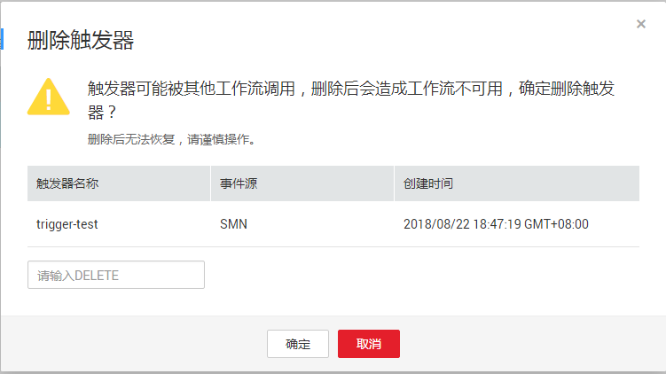

# 工作流触发器管理

工作流触发器可以被编排在Event类型的工作流中，称为内部触发器。也可以与工作流绑定，称为外部触发器。

内部触发器编排在工作流中，只有执行工作流，使工作流处于运行状态后，当对应的事件产生时，才能触发工作流内部节点运行。内部触发器的使用可以参考[执行工作流](工作流管理.md#section106943215479)。

可以在工作流创建以后再绑定外部触发器，对应事件产生时，可以触发工作流执行。外部触发器的使用可以参考[工作流绑定外部触发器](工作流绑定外部触发器.md)。

## 前提条件

已开启消息通知服务，并且在消息通知服务中创建主题。创建过程请参考[创建消息主题](https://support.huaweicloud.com/usermanual-smn/zh-cn_topic_0043961401.html)。

## 创建工作流触发器

工作流触发器用于编排在工作流中，触发某个事件的执行。目前支持的工作流触发器类型有SMN、Worker、OBS。

1.  用户登录FunctionGraph，选择“工作流\>工作流触发器”，进入“工作流触发器”界面。
2.  在“工作流触发器”界面，单击“创建触发器”，进入“创建触发器”界面。
3.  在“创建触发器”界面，填写触发器配置信息。如[表1](#table16705107144049)、[表2](#table19132495155948)所示。带\*参数为必填项。

    **表 1**  触发器配置信息

    
    <table><thead align="left"><tr id="row14493034144049"><th class="cellrowborder" valign="top" width="50%" id="mcps1.2.3.1.1">
配置项

    </th>
    <th class="cellrowborder" valign="top" width="50%" id="mcps1.2.3.1.2">
说明

    </th>
    </tr>
    </thead>
    <tbody><tr id="row41268785144049"><td class="cellrowborder" valign="top" width="50%" headers="mcps1.2.3.1.1 ">
*名称

    </td>
    <td class="cellrowborder" valign="top" width="50%" headers="mcps1.2.3.1.2 ">
触发器名称，命名规则为：触发器的名称只能包含大写字母、小写字母、数字和特殊字符(-)，长度小于等于32个字符。

    </td>
    </tr>
    <tr id="row23467680144049"><td class="cellrowborder" valign="top" width="50%" headers="mcps1.2.3.1.1 ">
描述

    </td>
    <td class="cellrowborder" valign="top" width="50%" headers="mcps1.2.3.1.2 ">
触发器的描述长度小于等于256个字符。

    </td>
    </tr>
    <tr id="row12115693144049"><td class="cellrowborder" valign="top" width="50%" headers="mcps1.2.3.1.1 ">
*事件源

    </td>
    <td class="cellrowborder" valign="top" width="50%" headers="mcps1.2.3.1.2 ">
支持SMN、OBS和Worker。

    </td>
    </tr>
    </tbody>
    </table>

    **表 2**  事件源配置项说明

    
    <table><thead align="left"><tr id="row16539702155948"><th class="cellrowborder" valign="top" width="33.33333333333333%" id="mcps1.2.4.1.1">
事件源

    </th>
    <th class="cellrowborder" valign="top" width="33.33333333333333%" id="mcps1.2.4.1.2">
配置项

    </th>
    <th class="cellrowborder" valign="top" width="33.33333333333333%" id="mcps1.2.4.1.3">
说明

    </th>
    </tr>
    </thead>
    <tbody><tr id="row50582656155948"><td class="cellrowborder" valign="top" width="33.33333333333333%" headers="mcps1.2.4.1.1 ">
SMN

    </td>
    <td class="cellrowborder" valign="top" width="33.33333333333333%" headers="mcps1.2.4.1.2 ">
*主题

    </td>
    <td class="cellrowborder" valign="top" width="33.33333333333333%" headers="mcps1.2.4.1.3 ">
SMN消息主题，从已创建消息主题中选择，如果未创建，需要去“消息通知服务”创建，请参考<a href="https://support.huaweicloud.com/usermanual-smn/zh-cn_topic_0043961401.html" target="_blank" rel="noopener noreferrer">创建消息主题</a>。

    </td>
    </tr>
    <tr id="row11106912387"><td class="cellrowborder" rowspan="4" valign="top" width="33.33333333333333%" headers="mcps1.2.4.1.1 ">
OBS

    </td>
    <td class="cellrowborder" valign="top" width="33.33333333333333%" headers="mcps1.2.4.1.2 ">
*存储桶

    </td>
    <td class="cellrowborder" valign="top" width="33.33333333333333%" headers="mcps1.2.4.1.3 ">
用作事件源的OBS存储桶。如果未创建，需要去“对象存储服务”创建，请参考<a href="https://support.huaweicloud.com/usermanual-obs/zh-cn_topic_0045829050.html" target="_blank" rel="noopener noreferrer">创建存储桶</a>。

    </td>
    </tr>
    <tr id="row4985161315382"><td class="cellrowborder" valign="top" headers="mcps1.2.4.1.1 ">
*事件类型

    </td>
    <td class="cellrowborder" valign="top" headers="mcps1.2.4.1.2 ">
选择要使其触发工作流的事件。支持的事件类型请参考<a href="#table352315412288">表3</a>。

    </td>
    </tr>
    <tr id="row7431121663812"><td class="cellrowborder" valign="top" headers="mcps1.2.4.1.1 ">
前缀

    </td>
    <td class="cellrowborder" valign="top" headers="mcps1.2.4.1.2 ">
用来限制以此关键字开头的对象的事件通知，该限制可以实现对OBS对象名的过滤。

    </td>
    </tr>
    <tr id="row11923122015388"><td class="cellrowborder" valign="top" headers="mcps1.2.4.1.1 ">
后缀

    </td>
    <td class="cellrowborder" valign="top" headers="mcps1.2.4.1.2 ">
用来限制以此关键字结尾的对象的事件通知。该限制可以实现对OBS对象名的过滤。

    </td>
    </tr>
    <tr id="row36246781155948"><td class="cellrowborder" valign="top" width="33.33333333333333%" headers="mcps1.2.4.1.1 ">
Worker

    </td>
    <td class="cellrowborder" valign="top" width="33.33333333333333%" headers="mcps1.2.4.1.2 ">
*事件类型

    </td>
    <td class="cellrowborder" valign="top" width="33.33333333333333%" headers="mcps1.2.4.1.3 ">
从下拉列表中选择，支持

    
WorkRequest、HeartBeat、WorkSuccess、WorkFailure四种类型。

    </td>
    </tr>
    </tbody>
    </table>

    **表 3**  OBS事件说明

    
    <table><thead align="left"><tr id="row1252324192813"><th class="cellrowborder" valign="top" width="33.33333333333333%" id="mcps1.2.4.1.1">
事件类

    </th>
    <th class="cellrowborder" valign="top" width="33.33333333333333%" id="mcps1.2.4.1.2">
事件

    </th>
    <th class="cellrowborder" valign="top" width="33.33333333333333%" id="mcps1.2.4.1.3">
事件说明

    </th>
    </tr>
    </thead>
    <tbody><tr id="row185231241162814"><td class="cellrowborder" rowspan="5" valign="top" width="33.33333333333333%" headers="mcps1.2.4.1.1 ">
ObjectCreated

    </td>
    <td class="cellrowborder" valign="top" width="33.33333333333333%" headers="mcps1.2.4.1.2 ">
—

    </td>
    <td class="cellrowborder" valign="top" width="33.33333333333333%" headers="mcps1.2.4.1.3 ">
新对象创建事件，选择ObjectCreated时，意味着Put/Post/Copy/CompleteMultipartUpload都被选上。

    </td>
    </tr>
    <tr id="row1523154172819"><td class="cellrowborder" valign="top" headers="mcps1.2.4.1.1 ">
Put

    </td>
    <td class="cellrowborder" valign="top" headers="mcps1.2.4.1.2 ">
更新对象。

    </td>
    </tr>
    <tr id="row13523144118289"><td class="cellrowborder" valign="top" headers="mcps1.2.4.1.1 ">
Post

    </td>
    <td class="cellrowborder" valign="top" headers="mcps1.2.4.1.2 ">
上传对象。

    </td>
    </tr>
    <tr id="row115237412280"><td class="cellrowborder" valign="top" headers="mcps1.2.4.1.1 ">
Copy

    </td>
    <td class="cellrowborder" valign="top" headers="mcps1.2.4.1.2 ">
复制对象。

    </td>
    </tr>
    <tr id="row252364142818"><td class="cellrowborder" valign="top" headers="mcps1.2.4.1.1 ">
CompleteMultipartUpload

    </td>
    <td class="cellrowborder" valign="top" headers="mcps1.2.4.1.2 ">
使用多段上传方式上传对象，多个段成功合并时触发。

    </td>
    </tr>
    <tr id="row7523184152816"><td class="cellrowborder" rowspan="3" valign="top" width="33.33333333333333%" headers="mcps1.2.4.1.1 ">
ObjectRemoved

    </td>
    <td class="cellrowborder" valign="top" width="33.33333333333333%" headers="mcps1.2.4.1.2 ">
—

    </td>
    <td class="cellrowborder" valign="top" width="33.33333333333333%" headers="mcps1.2.4.1.3 ">
对象删除事件，选择ObjectRemoved，意味着Delete/DeleteMarkerCreated都被选上。

    </td>
    </tr>
    <tr id="row115317412282"><td class="cellrowborder" valign="top" headers="mcps1.2.4.1.1 ">
Delete

    </td>
    <td class="cellrowborder" valign="top" headers="mcps1.2.4.1.2 ">
对象删除。

    </td>
    </tr>
    <tr id="row4500174622817"><td class="cellrowborder" valign="top" headers="mcps1.2.4.1.1 ">
DeleteMarkerCreated

    </td>
    <td class="cellrowborder" valign="top" headers="mcps1.2.4.1.2 ">
在OBS服务开启多版本支持后，如果不指定版本号删除对象，OBS会自动为该对象生成删除标记，此时会触发本事件。

    </td>
    </tr>
    </tbody>
    </table>

1.  单击“确定”，完成触发器创建。

## 绑定工作流触发器

对于Event类型的工作流，由于已经编排内部工作流触发器，不能再绑定外部触发器。HelloWorld、Operation、Switch、Delay等类型的工作流均可绑定外部工作流触发器。

1.  用户登录FunctionGraph，选择“工作流\>工作流列表”，进入“工作流列表”界面。
2.  在“工作流列表”界面，单击工作流名称，进入工作流详情界面。
3.  在工作流详情界面，单击“触发器”页签，进入触发界面。
4.  单击“绑定触发器”，如[图1](#fig33748573102635)所示，弹出“绑定触发器”界面。

    **图 1**  绑定触发器  
    

5.  在“绑定触发器”界面，输入如下信息，如[表4](#table4297779011238)所示。

    **表 4**  绑定触发器

    
    <table><thead align="left"><tr id="row923287511238"><th class="cellrowborder" valign="top" width="33.33333333333333%" id="mcps1.2.4.1.1">
参数

    </th>
    <th class="cellrowborder" valign="top" width="33.33333333333333%" id="mcps1.2.4.1.2">
类型

    </th>
    <th class="cellrowborder" valign="top" width="33.33333333333333%" id="mcps1.2.4.1.3">
操作说明

    </th>
    </tr>
    </thead>
    <tbody><tr id="row437073211238"><td class="cellrowborder" rowspan="2" valign="top" width="33.33333333333333%" headers="mcps1.2.4.1.1 ">
触发器类型

    </td>
    <td class="cellrowborder" valign="top" width="33.33333333333333%" headers="mcps1.2.4.1.2 ">
已创建

    </td>
    <td class="cellrowborder" valign="top" width="33.33333333333333%" headers="mcps1.2.4.1.3 ">
-

    </td>
    </tr>
    <tr id="row6459250311238"><td class="cellrowborder" valign="top" headers="mcps1.2.4.1.1 ">
新创建

    </td>
    <td class="cellrowborder" valign="top" headers="mcps1.2.4.1.2 ">
新创建工作流触发器，请参考<a href="#section1184012349393">创建工作流触发器</a>。

    </td>
    </tr>
    <tr id="row3363737211238"><td class="cellrowborder" valign="top" width="33.33333333333333%" headers="mcps1.2.4.1.1 ">
触发器

    </td>
    <td class="cellrowborder" valign="top" width="33.33333333333333%" headers="mcps1.2.4.1.2 ">
-

    </td>
    <td class="cellrowborder" valign="top" width="33.33333333333333%" headers="mcps1.2.4.1.3 ">
从已创建的工作流触发器列表中选择。

    </td>
    </tr>
    </tbody>
    </table>

6.  单击“确定”，完成触发器绑定。

## 解绑工作流触发器

1.  用户登录FunctionGraph，选择“工作流\>工作流列表”，进入“工作流列表”界面。
2.  在“工作流列表”界面，单击工作流名称，进入工作流详情界面。
3.  在工作流详情界面，单击“触发器”页签，进入“触发器”界面。
4.  在“触发器”界面，选中触发器，单击“解除绑定”，如[图2](#fig61084372172224)所示，弹出“解绑触发器”界面。

    **图 2**  解绑触发器  
    

5.  在“解绑触发器”界面，单击“确定”，完成触发器解绑。

## 删除工作流触发器

1.  用户登录FunctionGraph，选择“工作流\>工作流触发器”，进入“工作流触发器”界面。
2.  在“工作流触发器”界面，选择待删除的触发器，单击“删除”，如[图3](#fig13520261172659)所示，弹出“删除触发器”界面。

    **图 3**  删除工作流触发器  
    

3.  在“删除触发器”界面，输入“DELETE”（大写），单击“确定”，完成工作流触发器删除。如[图4](#fig185827485101)所示。

    **图 4**  删除校验  
    

    > **说明：**   
    >触发器可能被其他工作流调用，删除后会造成工作流不可用，删除后无法恢复，请谨慎操作。  

