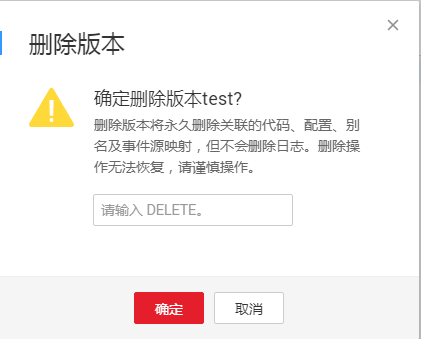
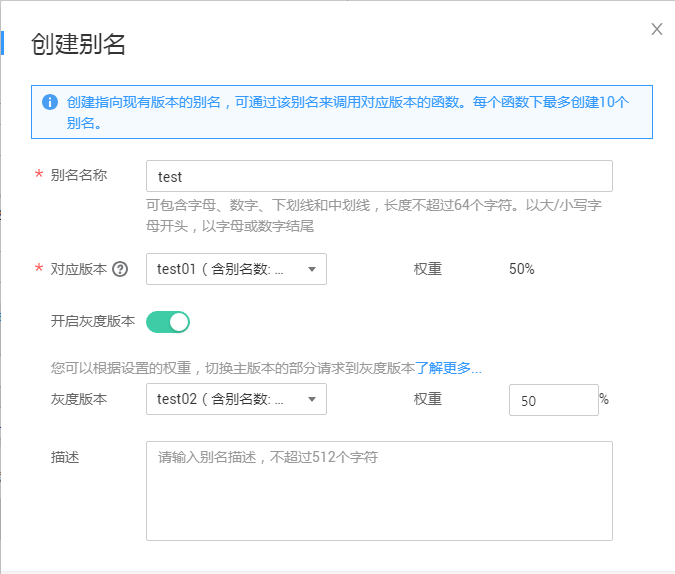
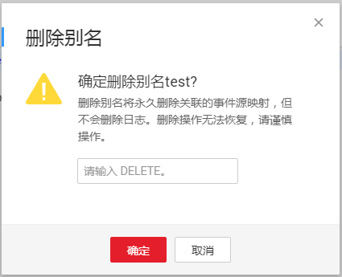

# 版本管理

## 管理版本

函数创建以后，默认版本为latest版本，每个函数都有一个latest版本。函数代码稳定后可以进行发布操作，一旦发布版本就不允许对该版本的信息（包括metadata以及函数代码）进行修改。

**发布版本**

1.  用户登录FunctionGraph，进入“函数”界面。
2.  选择“函数列表”，单击函数名称，进入函数详情界面。
3.  （可选）在函数详情界面，选择latest版本，单击“操作\>发布新版本”，如[图1](#fig11441486710)所示，弹出“发布版本”界面。

    > **说明：**   
    >1.  进入函数详情界面，缺省是版本管理页latest版本，可以通过单击“版本”和“别名”进行切换。  

    **图 1**  发布新版本  
    

4.  （可选）在“发布版本”界面，输入函数版本配置信息，如[表1](#table184411486714)所示。

    **表 1**  版本信息表

    
    <table><thead align="left"><tr id="row154494810715"><th class="cellrowborder" valign="top" width="50%" id="mcps1.2.3.1.1">
字段

    </th>
    <th class="cellrowborder" valign="top" width="50%" id="mcps1.2.3.1.2">
说明

    </th>
    </tr>
    </thead>
    <tbody><tr id="row12448481378"><td class="cellrowborder" valign="top" width="50%" headers="mcps1.2.3.1.1 ">
版本号

    </td>
    <td class="cellrowborder" valign="top" width="50%" headers="mcps1.2.3.1.2 ">
版本号命名规则为：可包含字母、数字、中划线、下划线和点，长度不超过32个字符，以字母/数字开头和结尾。

    </td>
    </tr>
    <tr id="row104417481875"><td class="cellrowborder" valign="top" width="50%" headers="mcps1.2.3.1.1 ">
描述

    </td>
    <td class="cellrowborder" valign="top" width="50%" headers="mcps1.2.3.1.2 ">
函数描述，不超过512个字符。

    </td>
    </tr>
    </tbody>
    </table>

5.  单击“发布”，系统自动完成版本发布，并生成版本号。

    > **说明：**   
    >-   如果输入了版本号，发布以后，版本号为用户输入的版本号。  
    >-   如果没有输入版本号，则由系统自动生成（使用日期时间作为版本号，例如：v20170819-190658）。  
    >-   单个函数下最多可以发布10个版本。  

**删除版本**

1.  用户登录[FunctionGraph](https://auth.huaweicloud.com/authui/login?service=https%3A%2F%2Fconsole.huaweicloud.com%2Ffunctiongraph%2F%3Fregion%3Dcn-north-1%26locale%3Dzh-cn%26activityId%3D3%26cloud_route_state%3D%2Fserverless%2Fdashboard#/login)，进入“函数”界面。
2.  选择“函数列表”，单击函数名称，进入函数详情界面。
3.  在函数详情界面，选择函数版本，单击“操作\>删除版本”，如[图2](#fig115141511911)所示，弹出“删除版本”页。

    **图 2**  删除版本  
    

    > **说明：**   
    >-   只有已发布版本才能删除，latest版本不能删除。  
    >-   如果函数版本关联了别名，则删除版本时会把关联的别名删除。  

4.  在“删除版本”页，输入“DELETE”（大写），单击“确定”，删除函数版本。如[图3](#fig12841105719403)所示。

    **图 3**  删除函数版本  
    

    > **警告：**   
    >-   删除操作无法恢复，请谨慎操作。  
    >-   提示“函数版本删除成功”，表示函数版本成功删除。  

## 管理别名

别名指向特定的函数版本，可通过别名来调用该版本的函数。

**创建别名**

1.  用户登录[FunctionGraph](https://auth.huaweicloud.com/authui/login?service=https%3A%2F%2Fconsole.huaweicloud.com%2Ffunctiongraph%2F%3Fregion%3Dcn-north-1%26locale%3Dzh-cn%26activityId%3D3%26cloud_route_state%3D%2Fserverless%2Fdashboard#/login)，进入“函数”界面。
2.  选择“函数列表”，单击函数名称，进入函数详情界面。
3.  在函数详情界面，选择函数版本，单击“操作\>创建别名”，如[图4](#fig92987917113)所示，弹出“创建别名”页面。

    **图 4**  创建别名  
    

4.  在“创建别名”页面，填写别名信息。如下[表2](#table929849111113)所示，带\*参数为必填项。

    **表 2**  别名信息表

    
    <table><thead align="left"><tr id="row529810911116"><th class="cellrowborder" valign="top" width="50%" id="mcps1.2.3.1.1">
字段

    </th>
    <th class="cellrowborder" valign="top" width="50%" id="mcps1.2.3.1.2">
说明

    </th>
    </tr>
    </thead>
    <tbody><tr id="row92984912114"><td class="cellrowborder" valign="top" width="50%" headers="mcps1.2.3.1.1 ">
*别名名称

    </td>
    <td class="cellrowborder" valign="top" width="50%" headers="mcps1.2.3.1.2 ">
别名名称。规则为：只能以大小写字母开头，且只能包含字母、数字、下划线和中划线，必须以字母或者数字结尾，长度不超过64个字符。

    </td>
    </tr>
    <tr id="row72983921114"><td class="cellrowborder" valign="top" width="50%" headers="mcps1.2.3.1.1 ">
*对应版本

    </td>
    <td class="cellrowborder" valign="top" width="50%" headers="mcps1.2.3.1.2 ">
关联版本，从函数已有版本中选择。

    </td>
    </tr>
    <tr id="row260618413616"><td class="cellrowborder" valign="top" width="50%" headers="mcps1.2.3.1.1 ">
灰度版本

    </td>
    <td class="cellrowborder" valign="top" width="50%" headers="mcps1.2.3.1.2 ">
函数新增支持灰度发布功能，创建别名时可以绑定多版本，并且可以设置主版本和灰度版本的权重，如<a href="#fig14746742111914">图5</a>所示。

    
 说明： 

版本权重为0-100之间的整数。

    

    </td>
    </tr>
    <tr id="row429815951110"><td class="cellrowborder" valign="top" width="50%" headers="mcps1.2.3.1.1 ">
描述

    </td>
    <td class="cellrowborder" valign="top" width="50%" headers="mcps1.2.3.1.2 ">
函数描述，不超过512个字符。

    </td>
    </tr>
    </tbody>
    </table>

    发布灰度版本及设置权重如下：

    **图 5**  发布灰度版本  
    

5.  单击“确定”，完成别名创建。

    > **说明：**   
    >-   不开启灰度版本则只发布主版本。  
    >-   弹出“创建别名”页，提示“发布成功”，表示别名创建成功。  
    >-   单个函数下最多可以创建10个别名。  

**修改别名**

1.  用户登录[FunctionGraph](https://auth.huaweicloud.com/authui/login?service=https%3A%2F%2Fconsole.huaweicloud.com%2Ffunctiongraph%2F%3Fregion%3Dcn-north-1%26locale%3Dzh-cn%26activityId%3D3%26cloud_route_state%3D%2Fserverless%2Fdashboard#/login)，进入“函数”界面。
2.  选择“函数列表”，单击函数名称，进入函数详情界面。
3.  打开函数配置页面，选择函数版本，单击“别名”页签，选择要修改的别名。
4.  在函数“配置”页面，修改别名信息。如下[表3](#table1467375391213)所示，带\*参数为必填项。

    **表 3**  别名信息表

    
    <table><thead align="left"><tr id="row8673105351219"><th class="cellrowborder" valign="top" width="50%" id="mcps1.2.3.1.1">
字段

    </th>
    <th class="cellrowborder" valign="top" width="50%" id="mcps1.2.3.1.2">
说明

    </th>
    </tr>
    </thead>
    <tbody><tr id="row567325301215"><td class="cellrowborder" valign="top" width="50%" headers="mcps1.2.3.1.1 ">
*对应版本

    </td>
    <td class="cellrowborder" valign="top" width="50%" headers="mcps1.2.3.1.2 ">
关联版本，从函数已有版本中选择。

    </td>
    </tr>
    <tr id="row817074415308"><td class="cellrowborder" valign="top" width="50%" headers="mcps1.2.3.1.1 ">
灰度版本

    </td>
    <td class="cellrowborder" valign="top" width="50%" headers="mcps1.2.3.1.2 ">
函数新增支持灰度发布功能，创建别名时可以绑定多版本，并且可以设置主版本和灰度版本的权重。修改灰度版本如<a href="#fig74501617163618">图6</a>所示。

    </td>
    </tr>
    <tr id="row13673953181214"><td class="cellrowborder" valign="top" width="50%" headers="mcps1.2.3.1.1 ">
描述

    </td>
    <td class="cellrowborder" valign="top" width="50%" headers="mcps1.2.3.1.2 ">
函数描述，不超过512个字符。

    </td>
    </tr>
    </tbody>
    </table>

    可以在“配置”界面修改灰度版本和权重比例，如下所示。

    **图 6**  修改别名灰度版本信息  
    

5.  单击“保存”，完成函数别名修改。

**删除别名**

1.  用户登录[FunctionGraph](https://auth.huaweicloud.com/authui/login?service=https%3A%2F%2Fconsole.huaweicloud.com%2Ffunctiongraph%2F%3Fregion%3Dcn-north-1%26locale%3Dzh-cn%26activityId%3D3%26cloud_route_state%3D%2Fserverless%2Fdashboard#/login)，进入“函数”界面。
2.  在“函数”界面，单击函数名称，进入函数详情界面。
3.  在函数详情界面，选择函数别名，如[图7](#fig20811253151919)所示。

    **图 7**  函数别名  
    

4.  单击“操作\>删除别名”页签，如[图8](#fig15157753152529)所示，弹出“删除别名”页面。

    **图 8**  删除函数别名  
    

5.  在“删除别名”页面，输入“DELETE”（大写），单击“确定”，完成函数别名删除。如[图9](#fig494113405447)所示。

    **图 9**  删除别名  
    

