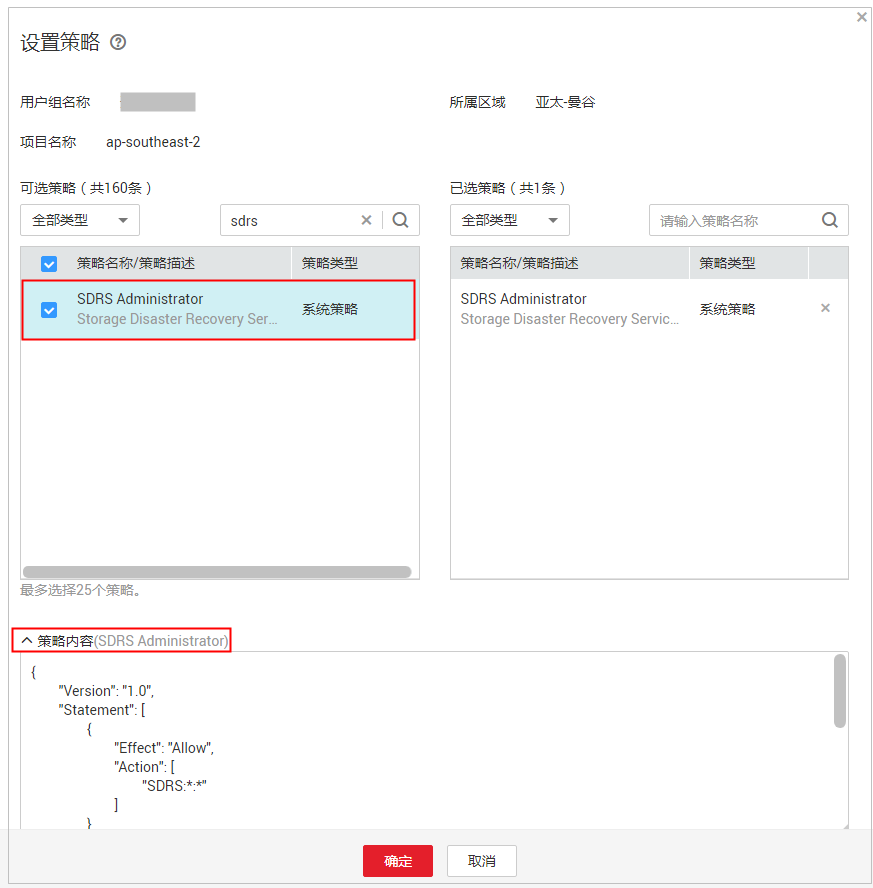

# 策略语法：RBAC<a name="ZH-CN_TOPIC_0170683657"></a>

## 策略结构<a name="section12417203785616"></a>

策略结构包括：策略版本号（Version）、策略授权语句（Statement）和策略依赖（Depends）。

**图 1**  策略结构<a name="fig17101037195610"></a>  


## 策略语法<a name="section1242843765616"></a>

如下以SDRS服务的“SDRSAdministraor”为例，说明RBAC策略语法。

**图 2**  策略语法<a name="fig614021320177"></a>  


```
{ 
        "Version": "1.0", 
        "Statement": [ 
                { 
                        "Action": [ 
                                "SDRS:*:*" 
                        ], 
                        "Effect": "Allow" 
                } 
        ], 
        "Depends": [ 
                { 
                        "catalog": "BASE", 
                        "display_name": "Tenant Guest" 
                }, 
                { 
                        "catalog": "BASE", 
                        "display_name": "Server Administrator" 
                } 
        ] 
}
```

<a name="table14361637155613"></a>
<table><thead align="left"><tr id="row77101537125615"><th class="cellrowborder" colspan="2" valign="top" id="mcps1.1.5.1.1"><p id="p12710837185618"><a name="p12710837185618"></a><a name="p12710837185618"></a>参数</p>
</th>
<th class="cellrowborder" valign="top" id="mcps1.1.5.1.2"><p id="p2710113719567"><a name="p2710113719567"></a><a name="p2710113719567"></a>含义</p>
</th>
<th class="cellrowborder" valign="top" id="mcps1.1.5.1.3"><p id="p9711737185617"><a name="p9711737185617"></a><a name="p9711737185617"></a>值</p>
</th>
</tr>
</thead>
<tbody><tr id="row1711133718566"><td class="cellrowborder" colspan="2" valign="top" headers="mcps1.1.5.1.1 "><p id="p2071103715611"><a name="p2071103715611"></a><a name="p2071103715611"></a>Version</p>
</td>
<td class="cellrowborder" valign="top" headers="mcps1.1.5.1.2 "><p id="p8711133775618"><a name="p8711133775618"></a><a name="p8711133775618"></a>策略的版本</p>
</td>
<td class="cellrowborder" valign="top" headers="mcps1.1.5.1.3 "><p id="p1671133775612"><a name="p1671133775612"></a><a name="p1671133775612"></a>固定为“1.0”</p>
</td>
</tr>
<tr id="row77119377563"><td class="cellrowborder" rowspan="2" valign="top" width="17.17171717171717%" headers="mcps1.1.5.1.1 "><p id="p971119370560"><a name="p971119370560"></a><a name="p971119370560"></a>Statement</p>
</td>
<td class="cellrowborder" valign="top" width="17.17171717171717%" headers="mcps1.1.5.1.1 "><p id="p11711103705610"><a name="p11711103705610"></a><a name="p11711103705610"></a>Action</p>
</td>
<td class="cellrowborder" valign="top" width="28.28282828282828%" headers="mcps1.1.5.1.2 "><p id="p371110379563"><a name="p371110379563"></a><a name="p371110379563"></a>定义对SDRS的具体操作。</p>
</td>
<td class="cellrowborder" valign="top" width="37.37373737373737%" headers="mcps1.1.5.1.3 "><p id="p771111370565"><a name="p771111370565"></a><a name="p771111370565"></a>格式为：服务名:资源类型:操作</p>
<p id="p197111378569"><a name="p197111378569"></a><a name="p197111378569"></a>"SDRS:*:*"，表示对SDRS的所有操作，其中SDRS为服务名称；“*”为通配符，表示对所有的资源类型可以执行所有操作。</p>
</td>
</tr>
<tr id="row9711173713561"><td class="cellrowborder" valign="top" headers="mcps1.1.5.1.1 "><p id="p1471193725617"><a name="p1471193725617"></a><a name="p1471193725617"></a>Effect</p>
</td>
<td class="cellrowborder" valign="top" headers="mcps1.1.5.1.1 "><p id="p37111137135612"><a name="p37111137135612"></a><a name="p37111137135612"></a>定义Action中所包含的具体操作是否允许执行。</p>
</td>
<td class="cellrowborder" valign="top" headers="mcps1.1.5.1.2 "><a name="ul0711137115617"></a><a name="ul0711137115617"></a><ul id="ul0711137115617"><li>Allow：允许执行。</li><li>Deny：不允许执行。</li></ul>
</td>
</tr>
<tr id="row1171116374562"><td class="cellrowborder" rowspan="2" valign="top" width="17.17171717171717%" headers="mcps1.1.5.1.1 "><p id="p871113717562"><a name="p871113717562"></a><a name="p871113717562"></a>Depends</p>
</td>
<td class="cellrowborder" valign="top" width="17.17171717171717%" headers="mcps1.1.5.1.1 "><p id="p4711737125612"><a name="p4711737125612"></a><a name="p4711737125612"></a>catalog</p>
</td>
<td class="cellrowborder" valign="top" width="28.28282828282828%" headers="mcps1.1.5.1.2 "><p id="p11711163710569"><a name="p11711163710569"></a><a name="p11711163710569"></a>依赖的其他策略的所属目录。</p>
</td>
<td class="cellrowborder" valign="top" width="37.37373737373737%" headers="mcps1.1.5.1.3 "><p id="p1371143713569"><a name="p1371143713569"></a><a name="p1371143713569"></a>服务名称</p>
<p id="p9711237195619"><a name="p9711237195619"></a><a name="p9711237195619"></a>例如：BASE</p>
</td>
</tr>
<tr id="row1371143711567"><td class="cellrowborder" valign="top" headers="mcps1.1.5.1.1 "><p id="p8711337175614"><a name="p8711337175614"></a><a name="p8711337175614"></a>display_name</p>
</td>
<td class="cellrowborder" valign="top" headers="mcps1.1.5.1.1 "><p id="p371115374566"><a name="p371115374566"></a><a name="p371115374566"></a>依赖的其他权限的名称。</p>
</td>
<td class="cellrowborder" valign="top" headers="mcps1.1.5.1.2 "><p id="p1271116373564"><a name="p1271116373564"></a><a name="p1271116373564"></a>权限名称</p>
<p id="p12711637115612"><a name="p12711637115612"></a><a name="p12711637115612"></a>例如：Tenant Administrator</p>
</td>
</tr>
</tbody>
</table>

